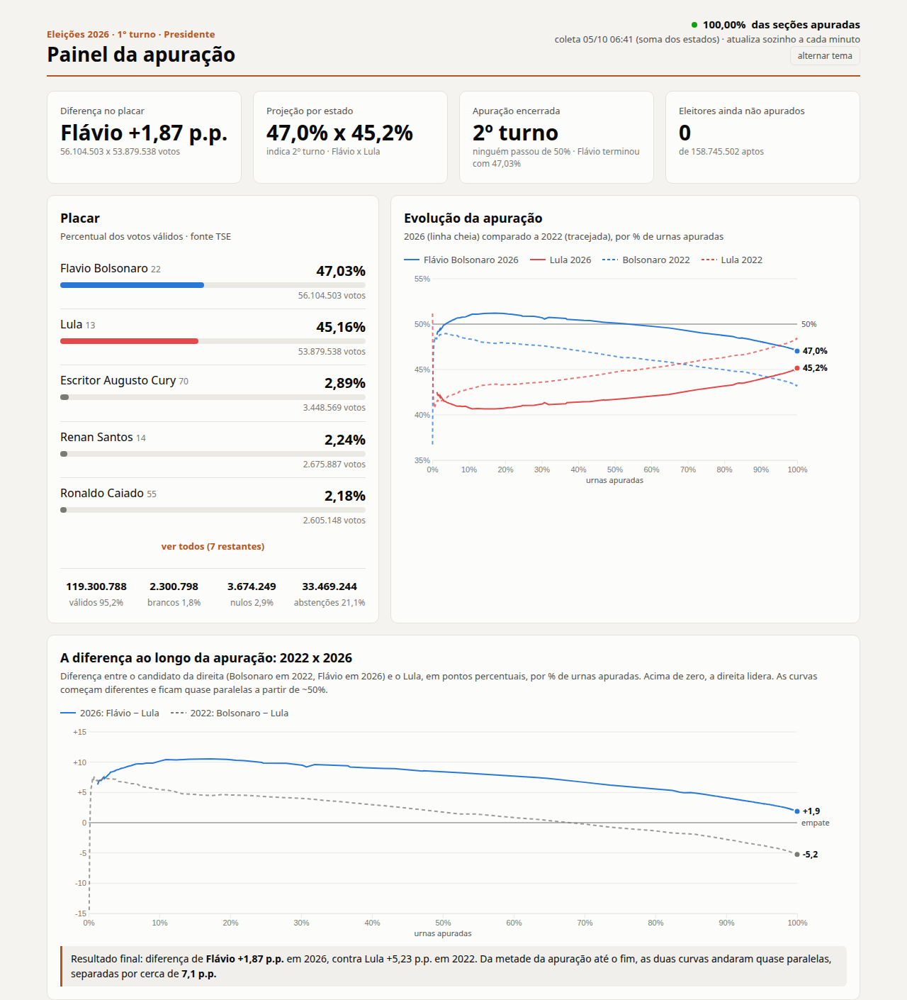

# Noite do Primeiro Turno 2026

O desenrolar da noite do primeiro turno da eleição para Presidente (04/10/2026), contado com dados: coleta automática direto da API pública do TSE, com histórico salvo a cada publicação, projeção por estado e um painel HTML que se atualiza sozinho.

O projeto foi feito **durante a noite da apuração**. Os CSVs em `dados/` são o registro real do que foi coletado, e o `notas.md` é o diário das observações feitas no caminho.

**Comece por aqui:** [`RETOMAR.md`](RETOMAR.md) diz onde paramos e o que falta; [`CONTEXTO.md`](CONTEXTO.md) tem o projeto inteiro (linha do tempo, achados, métodos, dicionário de dados e como conectar em R, Python, Power BI, Power Automate e Sheets). As análises estão em [`cases/`](cases/) e o rascunho do site em [`site/index.html`](site/index.html).



## O que ele faz

- **Coleta**: a cada 3 min consulta `resultados.tse.jus.br`. Grava só quando o TSE publica uma versão nova, o que acontece a cada 5–6 min durante a apuração.
- **Histórico**: guarda o placar nacional, o andamento e o placar de cada estado, e todos os candidatos em cada UF, em CSV.
- **Projeção por estado**: supõe que o que falta de cada estado vota igual ao que já foi apurado nele. Isso corrige o viés da ordem de chegada das urnas: o Sul é apurado antes do Nordeste, o que infla o placar parcial de um lado.
- **"Quanto precisa"**: calcula o % dos válidos restantes que o líder precisa para fechar acima de 50% e vencer no 1º turno.
- **Painel** (`painel/painel.html`): placar, evolução 2026 x 2022, projeção x placar ao longo da noite, mapa por estado, andamento por estado e região, e tabela. Funciona no modo claro, no escuro e no celular.
- **Prints**: a cada coleta, salva prints do placar e do mapa do g1 como evidência visual.

## Estrutura

```
coleta/    coletar.py · prints.js · status.py      → busca os dados e cuida da coleta
analise/   analisar.py · variacao.py · revisao.py · banco.py · exportar.py → compara, monta o banco e exporta
painel/    painel.py · template.html               → gera painel/painel.html
R/         01-explorar-apuracao.R                   → análise em R (dplyr + ggplot2)
cases/     uma análise por dúvida da noite          → base do site final
site/      index.html + dados.js                    → rascunho do site de rolagem
dados/     CSVs + apuracao.sqlite + export/ (+ brutos locais)
legado/    registrar.py · registrar_estado.py      → registro manual do começo da noite
notas.md   diário da apuração
```

| Arquivo | Função |
|---|---|
| `coleta/coletar.py` | Coleta do TSE e grava os CSVs; também gera o painel, atualiza o banco e tira os prints |
| `coleta/prints.js` | Prints do placar e do mapa do g1 com Puppeteer |
| `coleta/status.py` | Saúde da coleta: processo vivo, intervalo entre coletas, pastas completas |
| `analise/analisar.py` | Análise no terminal: tendência, quanto falta, projeção |
| `analise/variacao.py` | Estado a estado: o que entrou entre duas leituras, tendência do lote e saldo esperado do que falta |
| `analise/revisao.py` | Confere as ideias da noite (os cases) contra a coleta mais recente |
| `analise/exportar.py` | Exporta o banco para `dados/export/*.csv` (R, Python, Power BI…) e `site/dados.js` |
| `analise/historico_tse.py` | Histórico oficial 2002–2022 (abstenção, votos por turno) a partir dos dados abertos do TSE |
| `analise/banco.py` | Monta o banco SQLite `dados/apuracao.sqlite` a partir dos JSON brutos (incremental) |
| `painel/painel.py` + `painel/template.html` | Gera o `painel/painel.html` a partir dos dados |
| `R/01-explorar-apuracao.R` | Exemplo em R: placar, saldo por lote, por estado e por região |
| `site/index.html` | Rascunho do site de rolagem: gráfico fixo que avança com os marcos da noite |
| `cases/` | Pequenas análises feitas durante a noite, uma por dúvida (ver `cases/README.md`) |
| `legado/` | Registro manual, usado antes da coleta automática |

### Dados

| CSV | Uma linha por… |
|---|---|
| `snapshots.csv` | coleta: horário, % de seções apuradas, % e votos de Flávio e Lula |
| `estados.csv` | coleta × UF: % apurado, eleitorado, % de Flávio e Lula |
| `candidatos.csv` | coleta × abrangência (BR/UF) × candidato: votos e % |
| `palpites.csv` | palpite registrado, com a projeção do mesmo momento |

## Como rodar

Python 3 usa só a biblioteca padrão. Node.js e Google Chrome só são necessários para os prints.

```bash
npm install                                  # puppeteer-core (só para os prints)

python3 coleta/coletar.py                    # uma coleta
python3 coleta/coletar.py --a-cada 180 --print  # coleta contínua com prints
python3 coleta/status.py                     # está tudo ok?
python3 analise/analisar.py                  # análise no terminal
python3 analise/variacao.py                  # o que mudou por estado entre as 2 últimas coletas
python3 analise/revisao.py                   # as ideias da noite ainda se confirmam?
python3 analise/variacao.py --todas SP       # evolução de um estado em todas as coletas
xdg-open painel/painel.html                  # painel (recarrega a cada minuto)
```

Para deixar rodando em segundo plano:

```bash
nohup python3 -u coleta/coletar.py --a-cada 180 --print --git --parar-no-fim >> dados/coleta.log 2>&1 &
echo $! > dados/coleta.pid
kill $(cat dados/coleta.pid)                 # parar
```

Se o Chrome não estiver em `/usr/bin/google-chrome`, defina `CHROME_PATH`.

## Banco de dados e R

`dados/apuracao.sqlite` é atualizado a cada coleta, em formato longo, pronto para `dplyr`/`ggplot2`:

| Tabela / view | Uma linha por… |
|---|---|
| `coletas` | coleta (horário, versão do arquivo nacional do TSE) |
| `apuracao` | coleta × abrangência (BR, UF, ZZ): seções, eleitorado, válidos, brancos, nulos, abstenção |
| `votos` | coleta × abrangência × candidato: votos e % dos válidos |
| `candidatos`, `ufs` | número/nome/partido; UF/nome/região |
| `v_votos` | votos já com horário, região e nome do candidato |
| `v_nacional_soma` | nacional pela soma das UFs (mais atual que o arquivo BR do TSE) |

```r
library(DBI); library(dplyr)
con <- dbConnect(RSQLite::SQLite(), "dados/apuracao.sqlite")
tbl(con, "v_votos") |> filter(abrangencia != "BR", numero %in% c(13, 22)) |> collect()
```

Instalar R no Ubuntu: `sudo apt install r-base r-cran-tidyverse r-cran-rsqlite r-cran-dbi`. Exemplo completo em `R/01-explorar-apuracao.R`.

## Fontes

- **TSE**: `resultados.tse.jus.br/oficial/ele2026/6257/dados/<uf>/<uf>-c0001-e006257-u.json`, com votos por candidato, seções apuradas, eleitorado, brancos, nulos e abstenção. Eleição 6257 = Presidente, 1º turno.
- **UOL**: curva de evolução da apuração de 2026 e de 2022, usada só no gráfico comparativo.
- **g1**: prints do placar e do mapa.

## Lições da noite

- **O TSE publica dois arquivos que não andam juntos.** O `-ab.json` (andamento) fica alguns minutos **à frente** do `-u.json` (votos). No começo eu lia o % de urnas do primeiro e os votos do segundo, e o % apurado ficava inflado (44% em vez de 36,6%). A correção foi ler tudo do mesmo arquivo. Como os JSON brutos estavam guardados, deu para recalcular o histórico inteiro.
- **O placar parcial engana.** Com cerca de 20% apurado, o placar dava 51% para o líder, mas a projeção por estado já dava ~49%, porque o Sul estava muito mais apurado que o Nordeste.
- **Guardar o bruto compensa.** Todo erro de processamento pôde ser corrigido depois, sem perder dados.

## Limitações

- A projeção assume que o restante de cada estado vota igual ao já apurado nele. Diferenças entre capital e interior dentro do estado não entram na conta.
- Não é previsão oficial. É um exercício de coleta e análise de dados.
