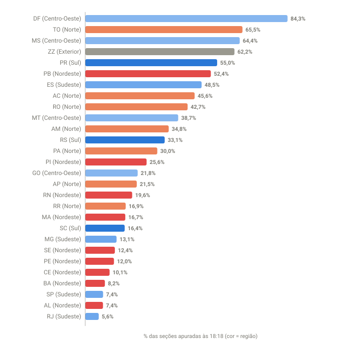

## Em resumo
- No começo da apuração, o placar mostrava Flávio Bolsonaro com ~51% contra ~41% de Lula.
- Esse número dizia mais sobre **quais estados tinham sido apurados primeiro** do que sobre o resultado: o Sul e o Centro-Oeste, onde o Flávio é mais forte, estavam muito mais adiantados que o Nordeste, onde o Lula é mais forte.
- Às 20:10, com 87% apurado, o Flávio já tinha caído para 48,3%. O placar parcial superestimava a vantagem dele.

## A pergunta
Às 18:07, com 12% das urnas apuradas, o Flávio estava na frente. Dá para tirar alguma conclusão já, ou é cedo?

## Para entender
- **% de seções apuradas:** quantas das ~499 mil seções eleitorais do país já tiveram os votos somados pelo TSE.
- **Votos válidos:** votos dados a algum candidato (excluem brancos e nulos). Os percentuais do placar são sobre os válidos.
- A apuração não acontece na mesma velocidade em todo o país. Fuso horário, logística e tamanho dos estados fazem alguns terminarem muito antes de outros.

## O que os dados mostraram
Primeira leitura manual (UOL, 18:13, 12,45%): **Flávio 51,09% x Lula 40,71%**.

Primeira coleta automática do TSE (18:18, 20,8% das seções), por região:

| Região | Seções apuradas às 18:18 |
|---|---|
| Exterior | 62,2% |
| Centro-Oeste | 44,9% |
| Sul | 37,3% |
| Norte | 35,8% |
| Nordeste | 15,6% |
| Sudeste | 10,5% |

**Como ler o gráfico:** cada barra é um estado; quanto maior, mais adiantada estava a apuração lá às 18:18. A cor indica a região: tons de azul para Sul, Sudeste e Centro-Oeste, laranja para o Norte, vermelho para o Nordeste. As barras do topo são quase todas azuis; as do Nordeste e dos grandes estados do Sudeste ficam embaixo.

Todos os estados às 18:18:

| Estado | Região | Apurado | Eleitorado | Placar no estado (Flávio x Lula) |
|---|---|---|---|---|
| Distrito Federal | Centro-Oeste | 84,3% | 2,26 mi | 51,2 x 38,2 |
| Tocantins | Norte | 65,5% | 1,18 mi | 50,6 x 43,2 |
| Mato Grosso do Sul | Centro-Oeste | 64,4% | 2,02 mi | 60,1 x 32,7 |
| Exterior | Exterior | 62,2% | 0,92 mi | 38,1 x 52,3 |
| Paraná | Sul | 55,0% | 8,61 mi | 60,2 x 30,7 |
| Paraíba | Nordeste | 52,4% | 3,25 mi | 33,5 x 60,7 |
| Espírito Santo | Sudeste | 48,5% | 2,99 mi | 56,2 x 36,2 |
| Acre | Norte | 45,6% | 0,61 mi | 63,6 x 29,3 |
| Rondônia | Norte | 42,7% | 1,27 mi | 63,1 x 29,2 |
| Mato Grosso | Centro-Oeste | 38,7% | 2,64 mi | 65,1 x 28,8 |
| Amazonas | Norte | 34,8% | 2,80 mi | 50,2 x 41,9 |
| Rio Grande do Sul | Sul | 33,1% | 8,52 mi | 57,6 x 33,8 |
| Pará | Norte | 30,0% | 6,26 mi | 45,8 x 47,4 |
| Piauí | Nordeste | 25,6% | 2,70 mi | 27,2 x 67,4 |
| Goiás | Centro-Oeste | 21,8% | 5,08 mi | 56,9 x 28,3 |
| Amapá | Norte | 21,5% | 0,58 mi | 41,0 x 51,5 |
| Rio Grande do Norte | Nordeste | 19,6% | 2,66 mi | 34,0 x 60,5 |
| Roraima | Norte | 16,9% | 0,40 mi | 67,8 x 27,6 |
| Maranhão | Nordeste | 16,7% | 5,18 mi | 34,0 x 60,5 |
| Santa Catarina | Sul | 16,4% | 5,73 mi | 62,0 x 29,4 |
| Minas Gerais | Sudeste | 13,1% | 16,37 mi | 49,1 x 41,5 |
| Sergipe | Nordeste | 12,4% | 1,74 mi | 34,9 x 57,9 |
| Pernambuco | Nordeste | 12,0% | 7,22 mi | 33,1 x 61,1 |
| Ceará | Nordeste | 10,1% | 7,00 mi | 33,7 x 60,2 |
| Bahia | Nordeste | 8,2% | 11,31 mi | 29,7 x 64,3 |
| São Paulo | Sudeste | 7,4% | 34,12 mi | 58,3 x 32,8 |
| Alagoas | Nordeste | 7,4% | 2,44 mi | 38,7 x 56,6 |
| Rio de Janeiro | Sudeste | 5,6% | 12,86 mi | 52,0 x 40,4 |

Bahia, Pernambuco e Ceará, juntos, tinham **~25 milhões de eleitores** e menos de 12% apurados.

## Como calculei
No começo, à mão: prints do UOL e do g1, com o % por estado estimado pela largura das barras (marcado como `uol-barra-estimada` em `dados/estados.csv`). A partir das 18:18, com os arquivos do TSE: seções apuradas ÷ seções totais de cada UF, somadas por região. Gráfico: `analise/graficos.py`.

## Conclusão
O placar com 12% (e mesmo com 20%) refletia a **ordem da apuração**, não o resultado. Estados mais favoráveis ao Flávio estavam mais adiantados; os mais favoráveis ao Lula, atrasados. Isso não é exclusivo de 2026: em 2022, o Bolsonaro liderou até ~67% das urnas e o Lula passou à frente quando o Nordeste entrou (ver o case 14). A pergunta certa não era "quem está na frente?", mas "**de onde ainda faltam votos?**" (case 08).

## Desfecho
**Checagem parcial (20:10, 87%):** Flávio caiu de 51,09% para 48,31%. Confirmado.

**Resultado final do 1º turno (100% das seções, TSE 05/10 02:59):** Flávio Bolsonaro **47,03%** (56.104.503 votos) x Lula **45,16%** (53.879.538), diferença de 2.224.965 votos (1,87 p.p.). 2º turno em 25/10.

Do placar das 18:13 (51,09%) ao final, o Flávio perdeu **4,06 p.p.**; o Lula ganhou 4,45 p.p. O placar parcial superestimava a vantagem dele em mais de 8 pontos de diferença. **Confirmado.**
