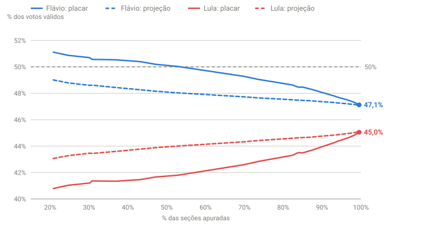

## Em resumo
- Se o placar engana por causa da ordem de apuração (case 01), dá para corrigir: supor que o que falta de cada estado vota igual ao que já foi apurado nele.
- Feita assim, a **projeção por estado** dava o Flávio com ~49% desde a primeira coleta (18:18), quando o placar mostrava 51%: indicava 2º turno.
- Ao longo da noite, o placar desceu em direção à projeção. Mas a projeção também desceu um pouco, porque o voto tardio dentro de cada estado foi diferente (case 11).

## A pergunta
Se o placar engana por causa da ordem de apuração, dá para corrigir esse viés e estimar onde a eleição termina?

## Para entender
- **Projeção por estado:** para cada estado, pego os votos já apurados e "completo" o que falta na mesma proporção. Depois somo os estados.
- Exemplo: se a Bahia tem 8% apurado e o Lula tem 64% lá, a projeção supõe que os outros 92% da Bahia também darão 64% ao Lula.
- **p.p. (pontos percentuais):** diferença entre dois percentuais. De 51% para 49% são 2 p.p.

## O que os dados mostraram

**Como ler o gráfico:** o eixo horizontal é o % de seções apuradas. Linhas cheias = placar do momento; tracejadas = projeção feita naquele momento. Azul = Flávio; vermelho = Lula. A linha cinza tracejada marca 50%: acima dela, vitória no 1º turno. A projeção do Flávio ficou abaixo de 50% desde o início; o placar só cruzou a linha com ~53% apurado.

| Hora | Apurado | Placar Flávio | Projeção Flávio | Placar Lula | Projeção Lula |
|---|---|---|---|---|---|
| 18:18 | 20,8% | 51,11% | **49,01%** | 40,79% | 43,07% |
| 18:22 | 24,6% | 50,87% | 48,79% | 41,04% | 43,28% |
| 18:35 | 36,9% | 50,53% | 48,44% | 41,34% | 43,60% |
| 18:52 | 52,8% | 50,03% | 48,03% | 41,79% | 44,00% |
| 19:14 | 69,8% | 49,28% | 47,73% | 42,59% | 44,33% |
| 19:41 | 84,9% | 48,47% | 47,46% | 43,49% | 44,65% |
| 20:14 | 89,1% | 48,14% | 47,38% | 43,86% | 44,74% |
| 21:32 | 99,4% | 47,15% | 47,09% | 45,01% | 45,09% |

## Como calculei
Para cada UF: votos do candidato ÷ fração do eleitorado já apurado (`eleitorado_apurado ÷ eleitorado`). Soma das UFs dividida pelos válidos projetados da mesma forma (`projecao()` em `painel/painel.py`; a série está em `dados/export/nacional.csv`, colunas `proj_flavio` e `proj_lula`). Valores recalculados com o placar nacional pela soma das UFs (case 10).

## Conclusão
Uma correção simples, feita só por estado, antecipou em mais de duas horas o que o placar mostraria: **o Flávio não chegaria a 50%** (o TSE confirmou o 2º turno às 20:57, case 19). Às 18:18, a projeção errou o final por ~2 p.p.; o placar da mesma hora, por ~4 p.p.

A limitação apareceu ao longo da noite: a projeção do Flávio caiu de 49,0% para ~47,1%. Ela supõe que o restante de cada estado vota igual ao já apurado, e isso não se confirmou: **dentro de cada estado, os votos apurados por último foram mais favoráveis ao Lula** (case 11). Uma projeção melhor precisaria olhar município ou zona eleitoral.

## Desfecho
**Checagem parcial (20:10, 87%):** placar 48,31%. A projeção das 18:18 (49,0%) errou 0,7 p.p.; o placar das 18:18 (51,1%), 2,8 p.p. Mas a própria projeção caiu para 47,4%: o voto tardio dentro dos estados veio mais Lula (case 11).

_comparar projeção das 18:18 com o resultado final_
