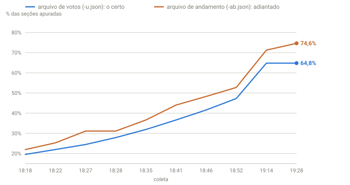

## Em resumo
- Comparando meu painel com o g1, os **votos batiam exatamente**, mas o **% de urnas apuradas** não: eu mostrava 44%, o g1 36,6%.
- A causa: eu lia o % de urnas de um arquivo do TSE e os votos de outro, e os dois não andam juntos.
- Como todos os JSON originais estavam guardados, recalculei o histórico inteiro em minutos.

## A pergunta
Posso confiar nesses números?

## Para entender
O TSE publica, para a mesma eleição, arquivos diferentes:
- **`-u.json` (resultado):** votos de cada candidato **e** % de seções apuradas que correspondem a esses votos.
- **`-ab.json` (andamento):** só o andamento da apuração por estado. Ele é atualizado com mais frequência e fica **à frente** do arquivo de votos.

Misturar os dois é como dividir os votos de agora pelo número de urnas de daqui a 5 minutos.

## O que os dados mostraram
Às 18:41, comparando com o print do g1 do mesmo momento:
- **Votos do Flávio:** 21.383.323 no meu registro, 21.383.323 no g1. Iguais.
- **% de urnas:** 44,01% no meu registro, 36,60% no g1.

**Como ler o gráfico:** cada ponto é uma coleta. A linha azul é o % de seções que está no arquivo de votos (o correto para o placar daquele momento); a laranja, o % do arquivo de andamento, que eu usava por engano. A laranja fica sempre acima: ela já contava seções cujos votos ainda não tinham entrado no arquivo de votos.

| Coleta | % no arquivo de votos (certo) | % no arquivo de andamento (o que eu usava) | Diferença |
|---|---|---|---|
| 18:18 | 19,54% | 21,96% | +2,4 p.p. |
| 18:22 | 21,96% | 25,29% | +3,3 p.p. |
| 18:27 | 24,45% | 31,11% | +6,7 p.p. |
| 18:35 | 31,90% | 36,60% | +4,7 p.p. |
| 18:41 | 36,60% | 44,01% | +7,4 p.p. |

## Como calculei
Script comparando os dois campos (`s.pst` de cada arquivo) em todas as pastas de `dados/brutos/`. Depois, reprocessamento de `snapshots.csv` e `estados.csv` a partir dos brutos, lendo votos e % de seções **do mesmo arquivo**. Os CSV antigos ficaram como `*.bak` (só locais).

## Conclusão
Duas lições que valeram para o resto da noite:
1. **Número e denominador sempre do mesmo arquivo.** Parece óbvio, mas os dois campos tinham o mesmo nome e significados diferentes.
2. **Guardar o bruto.** Sem os JSON originais, o histórico teria de ser descartado. Com eles, bastou reprocessar.

Validar contra uma fonte independente (o print do g1) foi o que revelou o erro.

## Desfecho
Corrigido às 18:46. Os CSV antigos ficaram em `*.bak` (fora do git).
