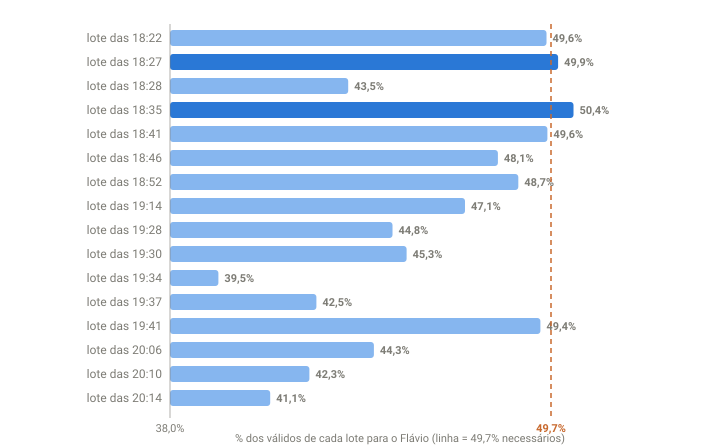

## Em resumo
- Para vencer no 1º turno, o Flávio precisava terminar com mais de 50% dos válidos. Com o que já tinha, isso exigia ~49,7% de todos os votos que ainda faltavam.
- Olhando cada **lote** (os votos que entram entre duas coletas), até ~18:41 ele ficava praticamente em cima da linha. A partir das 18:46, os lotes passaram a ficar abaixo.
- O acumulado ainda mostrava 50,4% quando os lotes novos já indicavam que ele não chegaria lá.

## A pergunta
O placar dele vai caindo. Está mudando o cenário?

## Para entender
- **Lote:** a diferença entre duas coletas. Se às 18:41 havia 36 milhões de válidos e às 18:46 havia 41 milhões, o lote tem 5 milhões de votos, e dá para ver quanto cada candidato levou desses 5 milhões.
- **Quanto precisa:** se faltam X votos e ele precisa chegar a 50% do total final, a conta diz qual fatia de X ele precisa levar.
- O **acumulado** reage devagar (é uma média de tudo); o **lote** mostra a tendência do momento.

## O que os dados mostraram

**Como ler o gráfico:** cada barra é um lote, de cima (18:22) para baixo (20:14). O comprimento é o % dos votos daquele lote que foram para o Flávio. A linha laranja tracejada marca os ~49,7% de que ele precisava. Barras escuras passaram da linha; claras ficaram abaixo. O eixo começa em 38% para as diferenças ficarem visíveis.

Lotes com mais de 300 mil votos, recalculados pela soma dos estados:

| Lote | Válidos no lote | Flávio | Lula | Abaixo de 49,7%? |
|---|---|---|---|---|
| 18:22 | 4,41 mi | 49,6% | 42,4% | no limite |
| 18:27 | 6,38 mi | 49,9% | 42,0% | não |
| 18:28 | 0,65 mi | 43,5% | 49,8% | sim |
| 18:35 | 7,17 mi | 50,4% | 41,3% | não |
| 18:41 | 7,36 mi | 49,6% | 42,1% | no limite |
| **18:46** | 4,67 mi | **48,1%** | 43,8% | **sim** |
| 18:52 | 6,73 mi | 48,7% | 42,8% | sim |
| 19:14 | 20,58 mi | 47,1% | 45,0% | sim |
| 19:28 | 4,55 mi | 44,8% | 47,4% | sim |
| 19:30 | 10,83 mi | 45,3% | 47,0% | sim |
| 19:34 | 1,32 mi | 39,5% | 54,5% | sim |
| 19:37 | 0,75 mi | 42,5% | 50,9% | sim |
| 19:41 | 1,09 mi | 49,4% | 41,3% | sim |
| 20:06 | 0,57 mi | 44,3% | 47,6% | sim |
| 20:10 | 2,08 mi | 42,3% | 50,6% | sim |
| 20:14 | 2,48 mi | 41,1% | 52,0% | sim |

Observação: na hora, usando o arquivo nacional do TSE, eu tinha visto o lote das 18:46 com **48,8%**. Recalculado pela soma dos estados (mais precisa, case 10), ele deu **48,1%**. A conclusão é a mesma.

A exigência foi subindo à medida que os lotes vinham abaixo: **49,7%** às 18:46, **50,7%** às 19:14, **60,7%** às 20:10 e **64%** às 20:14.

## Como calculei
- Válidos finais estimados = válidos atuais ÷ fração do eleitorado apurado.
- Necessário = (metade dos válidos finais − votos atuais do Flávio) ÷ (válidos finais − válidos atuais).
- % do lote = (votos do Flávio na coleta B − na coleta A) ÷ (válidos em B − válidos em A).

## Conclusão
O lote antecipou a tendência que o acumulado ainda escondia. Até ~18:41, o Flávio vinha fazendo quase exatamente o que precisava, e o 1º turno estava em aberto. A partir das 18:46, nenhum lote relevante voltou a passar da linha, e a exigência só cresceu. É um bom exemplo de por que **olhar a variação** e não só o total.

## Desfecho
**Checagem parcial (20:10, 87%):** de 11 lotes desde 18:46, 10 ficaram abaixo dos 49,7%. Agora ele precisaria de 60,7% do restante. 1º turno praticamente descartado. Confirmado às 20:57 (case 19).

**Resultado final do 1º turno (100% das seções, TSE 05/10 02:59):** Flávio Bolsonaro **47,03%** (56.104.503 votos) x Lula **45,16%** (53.879.538), diferença de 2.224.965 votos (1,87 p.p.). 2º turno em 25/10.

O Flávio terminou 2,97 p.p. abaixo dos 50% de que precisava. A partir das 18:46, nenhum lote relevante voltou a passar da linha. **Confirmado.**
