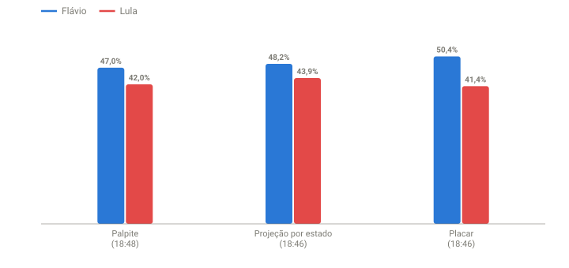

## Em resumo
- Olhando o gráfico do UOL que compara 2026 com 2022, arrisquei um resultado final: **Flávio 47% x Lula 42%**.
- A direção estava certa: o Flávio cairia abaixo de 50% e haveria 2º turno.
- Mas os números pediam algo improvável: o Flávio teria de despencar nos votos restantes, e os outros candidatos teriam de crescer de 8% para 11%.

## A pergunta
Olhando o gráfico 2022 x 2026 do UOL, meu palpite é **Flávio 47% x Lula 42%**. Faz sentido?

## O raciocínio do palpite
- **Flávio 47%:** pelo gráfico do UOL que compara 2026 com 2022, as linhas pareciam seguir a forma de 2022, em que a direita perdeu terreno até o fim.
- **Lula 42%:** eu esperava que Cury, Renan Santos e Caiado tivessem mais votos do que tiveram. Por isso deixei 11% para os outros candidatos. Eles terminaram com 7,8%, e essa diferença foi para o Lula.

## Para entender
- Um palpite de resultado final pode ser testado com a mesma conta do case 05: **quanto cada candidato precisaria fazer nos votos que faltam** para terminar naquele número.
- Se a exigência for muito diferente do que ele vem fazendo nos lotes, o palpite é improvável.
- Os percentuais de todos os candidatos somam 100%. Se Flávio + Lula = 89%, os outros dez candidatos teriam de somar 11%.

## O que os dados mostraram

**Como ler o gráfico:** três grupos de barras: o palpite, a projeção por estado e o placar, no momento do palpite (18:46–18:48). Azul = Flávio, vermelho = Lula. O palpite tem o Flávio abaixo da projeção e o Lula bem abaixo dela.

| | Palpite (18:48) | Projeção por estado (18:46) | Placar (18:46) |
|---|---|---|---|
| Flávio | 47% | 48,2% | 50,41% |
| Lula | 42% | 43,9% | 41,44% |
| Outros | 11% | 8,0% | 8,15% |

Testando o palpite (às 18:46, 41,6% apurado no arquivo nacional):

| Para terminar em… | Precisaria de… dos válidos restantes | Vinha fazendo nos lotes |
|---|---|---|
| Flávio 47% | 44,7% | 48–50% |
| Lula 42% | 42,4% | 42–44% |

- Para o Flávio fechar em 47%, ele teria de cair bem abaixo do que vinha fazendo. Possível, mas exigia uma mudança forte.
- Para o Lula fechar em 42%, bastaria repetir o que vinha fazendo, mas ele já tendia a passar disso.
- Os outros candidatos somavam 8,2% e ficaram estáveis a noite toda (8,0% às 19:41). Não havia sinal de que chegariam a 11%.

## Como calculei
Mesma conta do case 05, com o alvo de cada candidato no lugar dos 50%: (alvo × válidos finais − votos atuais) ÷ válidos restantes. Palpite registrado em `dados/palpites.csv`, junto com a projeção do mesmo momento.

## Conclusão
O palpite acertou a **direção** (queda do Flávio, 2º turno) e errou a **composição**. Se o Flávio caísse mais, os votos que ele deixasse de ter iriam sobretudo para o Lula, não para os outros candidatos. Isso apontava para algo como 47 x 44 ou 47 x 45, o que levou ao palpite ajustado das 20:27 (case 13).

## Desfecho
**Checagem parcial (20:10, 87%):** Flávio 48,31% x Lula 43,66%. Para o Flávio fechar em 47% bastam 38,7% do restante (os lotes recentes deram 36–45%), então ficou plausível. Para o Lula fechar em 42% ele precisaria de só 31,5% do restante, e vem fazendo 47–58%: não deve acontecer.

**Resultado final do 1º turno (100% das seções, TSE 05/10 02:59):** Flávio Bolsonaro **47,03%** (56.104.503 votos) x Lula **45,16%** (53.879.538), diferença de 2.224.965 votos (1,87 p.p.). 2º turno em 25/10.

| | Palpite (18:48) | Final | Erro |
|---|---|---|---|
| Flávio | 47% | 47,03% | −0,03 |
| Lula | 42% | 45,16% | **−3,16** |
| Outros | 11% | 7,81% | +3,19 |

O palpite cravou o Flávio e errou o Lula, exatamente pelo motivo apontado na hora: os votos que o Flávio perdeu foram para o Lula, não para os outros candidatos.
