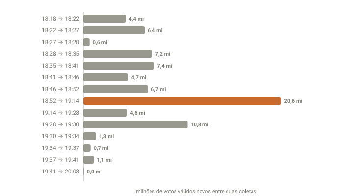

## Em resumo
- Por volta das 19h, os sites pararam de atualizar o placar por mais de 20 minutos.
- O coletor continuou consultando o TSE a cada 3 minutos, mas o arquivo nacional seguia na mesma versão.
- Às 19:14 o arquivo voltou com o maior lote da noite: **20,6 milhões de votos válidos de uma vez**. Não era falha do coletor.

## A pergunta
Ficou um tempo sem atualizar e atualizou agora. Foi o coletor que falhou?

## Para entender
- Cada arquivo do TSE traz a **hora de geração** (`hg`). Se a hora não muda, o arquivo não mudou.
- O coletor guarda uma "assinatura" das versões e só grava quando algo muda. Por isso o log mostra "sem atualização" quando o TSE não publica nada novo.

## O que os dados mostraram
O log mostrou o coletor consultando às 18:56, 18:59, 19:02, 19:05, 19:08 e 19:11, sempre com o arquivo nacional na versão **18:48:59**. Às **19:14:08** saiu a versão seguinte.

**Como ler o gráfico:** cada barra é o número de votos válidos novos entre duas coletas. A barra laranja (18:52 → 19:14) é a pausa: ela concentra os votos de mais de 20 minutos e é três vezes maior que qualquer outra.

| Intervalo | Votos válidos novos | Observação |
|---|---|---|
| 18:41 → 18:46 | 4,67 mi | |
| 18:46 → 18:52 | 6,73 mi | |
| **18:52 → 19:14** | **20,58 mi** | arquivo nacional parado de 18:48:59 a 19:14:08 |
| 19:14 → 19:28 | 4,55 mi | |
| 19:28 → 19:30 | 10,83 mi | estados voltando (case 10) |

No arquivo nacional, o salto foi de **47,3% para 64,8%** das seções.

## Como calculei
`coleta/status.py` mostra o intervalo entre coletas, se cada pasta está completa (30 arquivos) e a versão do TSE de cada coleta. O log (`dados/coleta.log`) registra cada consulta, inclusive as sem novidade.

## Conclusão
A pausa era do TSE, não do coletor. E investigá-la revelou algo mais importante: enquanto o arquivo **nacional** ficava parado, os arquivos dos **estados** continuavam publicando. O coletor só gravava quando o nacional mudava e por isso perdia esses dados. Isso virou o case 10 e mudou a forma de calcular o placar.

## Desfecho
Fechado.
