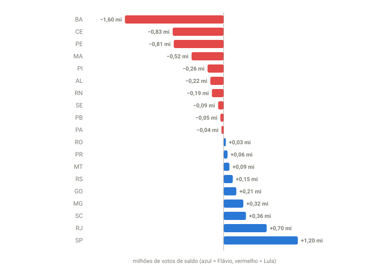

## Em resumo
- Saber **quantos votos faltam** em cada estado não basta. O que importa é **quanto falta × a margem local**: isso dá o saldo que cada estado ainda vai somar para cada candidato.
- Às 19:14, o que faltava somava **+4,63 milhões para o Lula** e **+3,22 milhões para o Flávio**. A Bahia, sozinha, pesava mais que São Paulo.
- Dentro de São Paulo, cada lote novo vinha menos favorável ao Flávio que o anterior: o saldo esperado de SP estava superestimado.

## A pergunta
Dos estados com eleitores em disputa, o que mudou de uma leitura para outra? Onde mais faltam votos e que tendência aparece?

## Para entender
- **Válidos que faltam em um estado:** se o estado tem 1 milhão de válidos com 50% do eleitorado apurado, faltam ~1 milhão.
- **Saldo esperado:** válidos que faltam × (% Flávio − % Lula) no estado. Exemplo: 4,6 milhões na Bahia × (29,8% − 64,5%) ≈ 1,6 milhão de votos a mais para o Lula.
- **"Em disputa"** é como os sites chamam os eleitores das seções ainda não apuradas.

## O que os dados mostraram

**Como ler o gráfico:** cada barra é o saldo que o estado ainda deveria entregar se o restante votasse como o já apurado. Vermelho (à esquerda) = saldo para o Lula; azul (à direita) = saldo para o Flávio. O tamanho combina quantos votos faltam e a margem do estado. Estados muito apurados (DF, TO) quase não pesam, mesmo com margens grandes.

Todos os estados às 19:14, do maior saldo para o Lula ao maior saldo para o Flávio:

| Estado | Apurado | Válidos que faltam | Placar (Flávio x Lula) | Saldo esperado |
|---|---|---|---|---|
| Bahia | 49% | 4,60 mi | 29,8 x 64,5 | Lula +1.600 mil |
| Ceará | 50% | 2,91 mi | 32,9 x 61,3 | Lula +826 mil |
| Pernambuco | 55% | 2,72 mi | 32,2 x 62,1 | Lula +809 mil |
| Maranhão | 59% | 1,74 mi | 32,3 x 62,3 | Lula +520 mil |
| Piauí | 73% | 0,58 mi | 25,0 x 69,8 | Lula +261 mil |
| Alagoas | 39% | 1,17 mi | 38,5 x 56,9 | Lula +216 mil |
| Rio Grande do Norte | 66% | 0,76 mi | 34,6 x 59,9 | Lula +191 mil |
| Sergipe | 81% | 0,30 mi | 31,6 x 61,7 | Lula +90 mil |
| Paraíba | 93% | 0,19 mi | 33,3 x 61,0 | Lula +53 mil |
| Pará | 71% | 1,47 mi | 45,8 x 48,2 | Lula +36 mil |
| Exterior | 64% | 0,13 mi | 38,5 x 52,0 | Lula +18 mil |
| Amapá | 69% | 0,17 mi | 44,3 x 47,3 | Lula +5 mil |
| Tocantins | 95% | 0,05 mi | 50,3 x 43,6 | Flávio +3 mil |
| Distrito Federal | 99% | 0,02 mi | 51,3 x 38,2 | Flávio +3 mil |
| Mato Grosso do Sul | 97% | 0,05 mi | 59,1 x 34,2 | Flávio +12 mil |
| Acre | 94% | 0,03 mi | 64,8 x 28,5 | Flávio +12 mil |
| Roraima | 90% | 0,04 mi | 71,1 x 22,7 | Flávio +18 mil |
| Espírito Santo | 95% | 0,12 mi | 55,2 x 37,4 | Flávio +22 mil |
| Amazonas | 73% | 0,61 mi | 48,4 x 44,2 | Flávio +25 mil |
| Rondônia | 91% | 0,09 mi | 67,0 x 26,3 | Flávio +35 mil |
| Paraná | 97% | 0,22 mi | 60,0 x 31,0 | Flávio +63 mil |
| Mato Grosso | 88% | 0,25 mi | 65,6 x 28,6 | Flávio +94 mil |
| Rio Grande do Sul | 88% | 0,75 mi | 55,5 x 35,9 | Flávio +148 mil |
| Goiás | 79% | 0,84 mi | 54,6 x 30,1 | Flávio +206 mil |
| Minas Gerais | 62% | 4,52 mi | 49,1 x 42,1 | Flávio +319 mil |
| Santa Catarina | 81% | 0,88 mi | 66,4 x 25,2 | Flávio +361 mil |
| Rio de Janeiro | 53% | 4,81 mi | 53,5 x 39,0 | Flávio +697 mil |
| São Paulo | 70% | 7,78 mi | 52,8 x 37,4 | Flávio +1.202 mil |
| **Total** | | | | **Lula +4,63 mi x Flávio +3,22 mi** |

Diferença no momento (arquivo nacional): Flávio +5,56 mi. Projetada para o fim: **Flávio +4,15 mi**.

**A tendência dentro de São Paulo** (os lotes vão ficando menos favoráveis ao Flávio, com uma pequena oscilação às 18:52):

| Lote | Flávio x Lula no lote |
|---|---|
| 18:22 | 54,9 x 35,5 |
| 18:27 | 54,2 x 36,1 |
| 18:35 | 53,8 x 36,3 |
| 18:41 | 52,6 x 37,5 |
| 18:46 | 51,3 x 38,7 |
| 18:52 | 51,6 x 38,3 |
| 19:14 | 51,0 x 39,0 |

Na maioria dos estados, os lotes recentes vieram mais favoráveis ao Lula que o acumulado: PI −6 p.p., GO −5, AM −11, MA −4.

## Como calculei
`analise/variacao.py` (compara duas coletas estado a estado; `--todas SP` mostra a série de um estado). Válidos que faltam por UF = válidos ÷ fração do eleitorado apurado − válidos. Saldo = válidos que faltam × (% Flávio − % Lula).

## Conclusão
O "quanto falta" sozinho não basta. São Paulo tinha mais votos faltando que qualquer outro estado, mas a Bahia, com metade dos votos e uma margem duas vezes maior, pesava mais. E a tendência **dentro** de São Paulo (cada lote menos Flávio) indicava que o saldo esperado de SP estava superestimado, ou seja, que a projeção ainda era otimista para ele. O case 11 confirmou isso.

## Desfecho
**Checagem parcial (20:10, 87%):** a tendência de SP se confirmou. Nos votos que entraram depois das 19:14, a margem do Flávio em SP foi +9,8 p.p. (previsto +15,4): 548 mil de saldo em vez de 866 mil. BA, CE e PE deram ainda mais ao Lula que o previsto.

**Resultado final do 1º turno (100% das seções, TSE 05/10 02:59):** Flávio Bolsonaro **47,03%** (56.104.503 votos) x Lula **45,16%** (53.879.538), diferença de 2.224.965 votos (1,87 p.p.). 2º turno em 25/10.

Saldo esperado às 19:14 x saldo real (de 19:14 até o fim):

| Estado | Esperado | Real |
|---|---|---|
| Bahia | Lula +1,60 mi | Lula **+1,84 mi** |
| São Paulo | Flávio +1,20 mi | Flávio **+0,77 mi** |
| Ceará | Lula +0,83 mi | Lula +1,03 mi |
| Pernambuco | Lula +0,81 mi | Lula +0,94 mi |
| Rio de Janeiro | Flávio +0,70 mi | Flávio +0,60 mi |
| Minas Gerais | Flávio +0,32 mi | Flávio +0,06 mi |
| **Total do país** | **Lula +1,41 mi** | **Lula +3,26 mi** |

A diferença projetada às 19:14 para o fim era Flávio +4,15 mi; a real foi **Flávio +2,22 mi**. O erro, de ~1,9 milhão de votos, foi todo na mesma direção: os estados do Lula entregaram mais que o esperado, e os do Flávio, menos (case 11).
