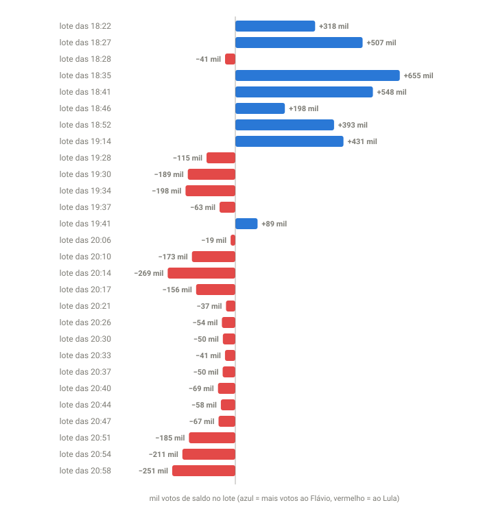

## Em resumo
- A noite teve duas fases. **Até 19:14**, quase todo lote deu mais votos ao Flávio. **Depois de 19:14**, quase todo lote deu mais votos ao Lula.
- "Favorecer" tem dois sentidos: ganhar **mais votos** no lote (saldo) ou ter um desempenho **melhor que a própria média** (o que move o percentual).
- O lote das 19:14 deu +431 mil votos de saldo ao Flávio e, mesmo assim, derrubou o percentual dele, porque a margem dele nesse lote (2 p.p.) foi menor que a acumulada (~8 p.p.).

## A pergunta
Cada vez que entraram dados, quem foi favorecido e por quanto? Quero um gráfico dos crescimentos por candidato e o mesmo por estado.

## Para entender
- **Saldo do lote:** votos novos do Flávio − votos novos do Lula naquele lote.
- **Efeito no percentual:** um candidato com 50% de média que faz 47% num lote **perde** percentual, mesmo que esse lote lhe dê mais votos que ao adversário.
- É como a média de notas: tirar 7 numa prova sobe a média de quem tinha 6 e baixa a de quem tinha 8.

## O que os dados mostraram

**Como ler o gráfico:** cada barra é uma atualização do TSE (lotes com mais de 300 mil votos). Azul, à direita = o lote deu mais votos ao Flávio; vermelho, à esquerda = mais votos ao Lula. O comprimento é o saldo em milhares de votos. A virada fica clara: azul até 19:14, vermelho quase sempre depois.

Todas as atualizações da noite, recalculadas pela soma dos estados:

| Lote | Válidos novos | Flávio | Lula | Saldo |
|---|---|---|---|---|
| 18:22 | 4,41 mi | 49,6% | 42,4% | Flávio +318 mil |
| 18:27 | 6,38 mi | 49,9% | 42,0% | Flávio +507 mil |
| 18:28 | 0,65 mi | 43,5% | 49,8% | Lula +41 mil |
| 18:35 | 7,17 mi | 50,4% | 41,3% | Flávio +655 mil |
| 18:41 | 7,36 mi | 49,6% | 42,1% | Flávio +548 mil |
| 18:46 | 4,67 mi | 48,1% | 43,8% | Flávio +198 mil |
| 18:52 | 6,73 mi | 48,7% | 42,8% | Flávio +393 mil |
| **19:14** | **20,58 mi** | 47,1% | 45,0% | **Flávio +431 mil** |
| 19:28 | 4,55 mi | 44,8% | 47,4% | Lula +115 mil |
| 19:30 | 10,83 mi | 45,3% | 47,0% | Lula +189 mil |
| 19:34 | 1,32 mi | 39,5% | 54,5% | Lula +198 mil |
| 19:37 | 0,75 mi | 42,5% | 50,9% | Lula +63 mil |
| 19:41 | 1,09 mi | 49,4% | 41,3% | Flávio +89 mil |
| 20:06 | 0,57 mi | 44,3% | 47,6% | Lula +19 mil |
| 20:10 | 2,08 mi | 42,3% | 50,6% | Lula +173 mil |
| 20:14 | 2,48 mi | 41,1% | 52,0% | Lula +269 mil |
| 20:17 | 1,13 mi | 39,8% | 53,6% | Lula +156 mil |
| 20:21 | 0,58 mi | 43,1% | 49,5% | Lula +37 mil |
| 20:26 | 0,46 mi | 40,7% | 52,3% | Lula +54 mil |
| 20:30 | 0,48 mi | 41,3% | 51,5% | Lula +50 mil |
| 20:33 | 0,34 mi | 40,5% | 52,5% | Lula +41 mil |
| 20:37 | 0,40 mi | 40,1% | 52,8% | Lula +50 mil |
| 20:40 | 0,50 mi | 39,8% | 53,6% | Lula +69 mil |
| 20:44 | 0,49 mi | 40,7% | 52,6% | Lula +58 mil |
| 20:47 | 0,55 mi | 40,5% | 52,7% | Lula +67 mil |
| 20:51 | 1,09 mi | 38,4% | 55,3% | Lula +185 mil |
| 20:54 | 1,70 mi | 40,5% | 52,9% | Lula +211 mil |
| 20:58 | 1,84 mi | 39,9% | 53,6% | Lula +251 mil |
| 21:01 | 1,71 mi | 37,5% | 56,5% | Lula +326 mil |
| 21:04 em diante | lotes pequenos (< 0,5 mi) | 26–35% | 59–70% | Lula, todos |

**O paradoxo do lote das 19:14:** foi o maior da noite e deu 431 mil votos a mais ao Flávio. Mas a margem dele no lote foi de 2,1 p.p. (47,1 x 45,0), contra ~8 p.p. no acumulado. Resultado: o percentual dele caiu de 50,0% para 49,3%.

**No saldo da noite, por estado** (até 19:28): Flávio: SP +2,32 mi, SC +1,31 mi, PR +797 mil, RJ +681 mil, RS +647 mil, GO +533 mil, MG +436 mil. Lula: BA +1,35 mi, PE +804 mil, CE +695 mil, MA +588 mil. Pará praticamente empatado. O painel mostra isso estado a estado na seção "O mesmo, por estado".

## Como calculei
Diferença de votos entre coletas consecutivas, com o nacional calculado como soma das UFs (case 10). Tabela completa em `dados/export/lotes.csv` (linhas com `abrangencia = BR` para o nacional e uma por UF). No painel: "Cada atualização: quem ela favoreceu e por quanto" e "O mesmo, por estado".

## Conclusão
Olhar só o percentual esconde o que acontece em cada atualização. Até 19:14, os lotes davam saldo ao Flávio e, ao mesmo tempo, encolhiam a vantagem percentual dele, porque vinham abaixo da média. Depois de 19:14, com o Nordeste entrando, os lotes passaram a dar saldo ao Lula, e a queda do Flávio acelerou. A reta final (depois das 21h) foi a mais desequilibrada: lotes pequenos com 60–70% para o Lula, vindos sobretudo da Bahia e do Ceará.

## Desfecho
**Checagem parcial (20:10, 87%):** desde 19:14 a fase mudou. A maioria dos lotes passou a dar saldo ao **Lula** (o de 19:30, por exemplo, teve 10,8 mi de válidos com 45,3% x 47,0%).

_a preencher_
