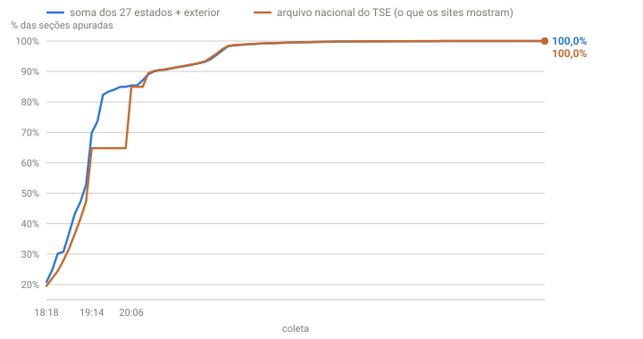

## Em resumo
- O TSE publica um arquivo por estado e um arquivo nacional. Os dos estados saem **antes**; o nacional consolida depois.
- Entre 19:14 e 20:04 o arquivo nacional ficou **parado** (64,81%), enquanto os estados continuaram publicando até ~85%.
- Passei a calcular o placar nacional **somando os 27 estados e o exterior**. Ele ficou mais atual que o dos sites, que mostram o arquivo nacional.

## A pergunta
Parece que atualizou duas vezes nos sites, mas o coletor não gravou nada novo. O que houve?

## Para entender
- O coletor só gravava quando o arquivo **nacional** (`br`) mudava. Se só os estados mudassem, ele achava que não havia novidade.
- Somar os estados é seguro: o arquivo nacional é exatamente a soma deles, só que publicada mais tarde. Quando os dois estão em dia, os números batem.

## O que os dados mostraram
Às 19:27, o arquivo nacional estava em 19:14:08 (64,81%), mas os estados já tinham versões novas: BA 19:17:16 (54%), MG 19:16:52 (68%), RJ 19:16:40 (57%), CE 19:17:07 (53%), PE 19:16:39 (60%).

**Como ler o gráfico:** cada ponto é uma coleta. Azul = % apurado pela soma dos estados; laranja = % do arquivo nacional, que é o que g1 e UOL exibem. O "degrau" laranja entre 19:14 e 20:06 é o período em que o nacional ficou parado enquanto os estados avançavam. A partir de ~20:14 as duas linhas andam juntas.

| Coleta | Soma das UFs | Arquivo nacional | Versão do nacional |
|---|---|---|---|
| 18:18 | 20,80% | 19,54% | 18:16:13 |
| 18:41 | 43,18% | 36,60% | 18:37:14 |
| 18:52 | 52,77% | 47,26% | 18:48:59 |
| 19:14 | 69,84% | 64,81% | 19:14:08 |
| 19:28 | 73,58% | 64,81% | 19:14:08 (parado) |
| 19:30 | 82,40% | 64,81% | 19:14:08 (parado) |
| 19:41 | 84,93% | 64,81% | 19:14:08 (parado) |
| 20:03 | 84,95% | 64,81% | 19:14:08 (parado) |
| **20:06** | 85,40% | **84,96%** | **20:04:39** (voltou) |
| 20:14 | 89,08% | 89,45% | 20:14:06 |
| 20:58 | 96,83% | 97,24% | 20:57:34 |
| 21:42 | 99,54% | 99,56% | 21:41:55 |

Depois que o nacional voltou, as duas medidas passaram a andar juntas (às vezes o nacional fica alguns centésimos à frente, por diferenças de horário entre as versões).

## Como calculei
Mudei o coletor para baixar os 29 arquivos em toda rodada e gravar quando **qualquer** um mudar (assinatura com a versão de todos). O placar nacional passou a ser Σ votos das UFs ÷ Σ válidos das UFs, e o % de seções, Σ seções apuradas ÷ Σ seções totais. O histórico inteiro foi recalculado a partir dos brutos guardados.

## Conclusão
O TSE publica cada estado primeiro e consolida o nacional depois. Por 50 minutos, quem acompanhava só o placar nacional, como os grandes sites, viu a apuração ~20 pontos atrasada. Somar os estados deu um placar mais atual e, quando o nacional voltou, confirmou o método: os números bateram.

## Desfecho
**Confirmado às 20:04.** O arquivo nacional ficou parado em 19:14:08 (64,81%) por 50 minutos. Quando voltou, às 20:04:39, marcou **84,96%**, praticamente o que a soma dos estados já mostrava desde 19:41 (84,93%). Ou seja, durante 50 minutos quem olhava só o nacional (g1, UOL) via um placar ~20 pontos de apuração atrasado.

| Hora | Soma das UFs (nosso) | Nacional do TSE (sites) |
|---|---|---|
| 19:41 | 84,93% | 64,81% (parado desde 19:14) |
| 20:06 | 85,40% | 84,96% (publicado às 20:04:39) |
