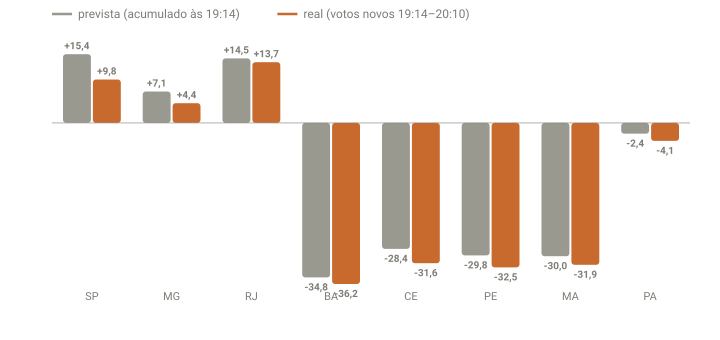

## Em resumo
- Às 20:10, com a apuração travada em ~87%, revisei todas as ideias da noite contra os dados.
- **Direção:** tudo o que apontava para queda do Flávio e 2º turno se confirmou.
- **Achado novo:** a projeção por estado errava **sempre a favor do Flávio**. Dentro de cada estado, os votos que chegaram por último eram mais favoráveis ao Lula do que os primeiros, inclusive em São Paulo e Minas.

## A pergunta
Agora que a apuração deu uma travada (~86%), as ideias que tive ao longo da noite se confirmaram ou mudou algo?

## Para entender
- A projeção por estado (case 03) supõe que o **restante** de cada estado vota igual ao **já apurado**.
- Para testar essa premissa, comparo a **margem prevista** (a margem do estado às 19:14) com a **margem real** dos votos que entraram depois, entre 19:14 e 20:10.
- Se a margem real for sistematicamente diferente, a projeção tem um **viés**.

## O que os dados mostraram
Placar às 20:10 (soma das UFs, 87,1% das seções): **Flávio 48,31% x Lula 43,66%**. Diferença: Flávio +4,80 milhões de votos.

| Ideia (case) | Na hora | Às 20:10 | Veredito |
|---|---|---|---|
| 01. O placar parcial não é o resultado | Flávio 51,09% com 12% apurado | 48,31% | ✅ caiu 2,8 p.p. |
| 03. Projeção por estado | 18:18: projeção 49,0% x placar 51,1% | placar 48,3% | ✅ projeção errou 0,7 p.p.; o placar da hora, 2,8 |
| 03. (continuação) | projeção 49,0% às 18:18 | projeção 47,4% às 20:10 | ⚠️ a projeção também caiu 1,6 p.p. |
| 05. Quanto precisa para o 1º turno | 49,7% do restante | **60,7%** | ✅ desde 18:46, 10 de 11 lotes abaixo da linha |
| 06. Palpite Flávio 47% | exigia 44,7% do restante | exige 38,7% (lotes recentes: 36–45%) | 🟡 ficou plausível |
| 06. Palpite Lula 42% | exigia 42,4% do restante | já tem 43,66% | ❌ não deve acontecer |
| 08. SP cada vez menos favorável ao Flávio | lotes de SP caindo (55 → 51) | margem real +9,8 x prevista +15,4 | ✅ SP rendeu 548 mil, não 866 mil |
| 09. Lotes com saldo do Flávio derrubando o % dele | até 19:14 | desde 19:14, os lotes dão saldo ao Lula | 🔄 a fase mudou |
| 10. Estados à frente do nacional | soma das UFs ~20 p.p. à frente | nacional alcançou às 20:04 | ✅ |

**Por que a projeção também caiu:**

**Como ler o gráfico:** para cada estado, a barra cinza é a margem Flávio − Lula que a projeção supunha (o acumulado às 19:14) e a laranja, a margem real dos votos que entraram entre 19:14 e 20:10. Barras acima de zero = vantagem do Flávio; abaixo = do Lula. Na maioria dos estados a barra laranja fica **mais para baixo** que a cinza: o voto tardio foi mais favorável ao Lula.

Os 16 estados com mais votos novos no período:

| Estado | Votos novos (19:14–20:10) | Margem prevista | Margem real | Diferença | Saldo previsto | Saldo real |
|---|---|---|---|---|---|---|
| SP | 5.608 mil | +15,4 | +9,8 | −5,7 | +866 mil | +548 mil |
| MG | 2.464 mil | +7,1 | +4,4 | −2,6 | +174 mil | +109 mil |
| RJ | 2.413 mil | +14,5 | +13,7 | −0,9 | +350 mil | +330 mil |
| BA | 1.932 mil | −34,8 | −36,2 | −1,5 | −672 mil | −700 mil |
| PE | 1.439 mil | −29,8 | −32,5 | −2,7 | −429 mil | −468 mil |
| CE | 1.283 mil | −28,4 | −31,6 | −3,2 | −364 mil | −405 mil |
| MA | 862 mil | −30,0 | −31,9 | −1,9 | −258 mil | −275 mil |
| PA | 801 mil | −2,4 | −4,1 | −1,6 | −20 mil | −32 mil |
| SC | 670 mil | +41,2 | +43,3 | +2,1 | +276 mil | +290 mil |
| RS | 657 mil | +19,6 | +21,6 | +2,0 | +129 mil | +142 mil |
| GO | 568 mil | +24,5 | +16,6 | −7,9 | +139 mil | +94 mil |
| RN | 446 mil | −25,2 | −24,5 | +0,8 | −113 mil | −109 mil |
| AL | 367 mil | −18,4 | −17,5 | +0,9 | −68 mil | −64 mil |
| AM | 308 mil | +4,2 | −17,2 | −21,4 | +13 mil | −53 mil |
| PI | 292 mil | −44,8 | −50,0 | −5,2 | −131 mil | −146 mil |
| PR | 163 mil | +29,0 | +20,4 | −8,7 | +47 mil | +33 mil |

(margens em p.p.; "diferença" = real − prevista; negativo = o voto tardio foi mais favorável ao Lula do que a projeção supunha)

- Em **12 dos 16** estados, a margem real ficou mais favorável ao Lula que a prevista.
- As exceções (SC, RS, RN, AL) são pequenas e vão nas duas direções.
- Nos 10 maiores estados, a projeção esperava um saldo de **144 mil para o Lula** nesse trecho; o real foi de **668 mil**.

## Como calculei
Consultas no banco `dados/apuracao.sqlite`: placar e "quanto precisa" na coleta mais recente; % de cada lote desde 18:46; por UF, a margem acumulada às 19:14 (o que a projeção supunha) comparada à margem dos votos que entraram entre 19:14 e 20:10. O script `analise/revisao.py` refaz essa revisão a qualquer momento.

## Conclusão
- **Direção:** tudo o que apontava para queda do Flávio e 2º turno se confirmou.
- **Tamanho:** a projeção por estado subestimou o Lula de forma sistemática. Dentro de cada estado, quem é apurado por último vota diferente de quem é apurado primeiro. A hipótese mais provável é que capitais e grandes cidades fiquem para o fim, mas isso só dá para confirmar com dados por município ou zona eleitoral.
- **Palpite:** o 47% do Flávio ficou plausível; o 42% do Lula já tinha ficado para trás.

## Desfecho
**Checagem 20:14 (89,1%, `analise/revisao.py`):** Flávio 48,14% x Lula 43,86%, diferença 4,53 mi. O último lote (2,5 mi de válidos) foi o mais favorável ao Lula da noite até ali: 52,0% x 41,1%. **Em 7 dos 8 maiores estados desse lote, os votos novos vieram mais favoráveis ao Lula que o acumulado** (SP −4, RJ −3, MG −3, BA −5, CE −3, PE −6, GO −4 p.p.). O viés da projeção cresceu: nos 8 maiores estados, desde 19:14, ela previa um saldo de 488 mil para o Lula e o real foi de 1,14 mi (erro de 650 mil a favor do Flávio).

**Resultado final do 1º turno (100% das seções, TSE 05/10 02:59):** Flávio Bolsonaro **47,03%** (56.104.503 votos) x Lula **45,16%** (53.879.538), diferença de 2.224.965 votos (1,87 p.p.). 2º turno em 25/10.

Projeção do Flávio x final: 18:18 → 49,01% (+1,98); 19:14 → 47,73% (+0,70); 20:10 → 47,43% (+0,40). A projeção ficou **acima do resultado em todas as leituras** e só convergiu quando quase não faltavam votos. O viés do voto tardio se confirmou até o fim: de 19:14 até o final, o saldo real do Lula (3,26 mi) foi mais que o dobro do esperado (1,41 mi; case 08).
