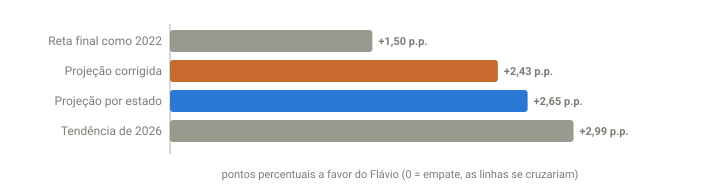

## Em resumo
- No gráfico de evolução do UOL, as linhas de Flávio e Lula estavam se aproximando. Em 2022, as linhas de Bolsonaro e Lula se cruzaram com ~67% apurado.
- Calculei a diferença final de quatro jeitos diferentes. Todos deram o Flávio na frente, entre **+1,5 e +3,0 p.p.**
- Para as linhas se cruzarem, a diferença teria de cair três vezes mais rápido do que vinha caindo.

## A pergunta
No gráfico de evolução do UOL, as linhas de 2026 estão se aproximando. Em 2022 elas se cruzaram perto de 67%. Isso vai acontecer agora?

## Para entender
- **Diferença (ou margem):** % do Flávio − % do Lula. Se chegar a zero, as linhas se cruzam.
- Usar **vários métodos** independentes ajuda: se todos apontam para o mesmo lugar, a conclusão é mais confiável.
- **Ritmo:** quanto a diferença cai a cada 1% de seções apuradas.

## O que os dados mostraram
Às 20:14 (soma das UFs, 89,1% das seções): **Flávio 48,14% x Lula 43,86%**, diferença de **4,28 p.p.**

**Como ler o gráfico:** cada barra é a diferença final que um método estima. Todas ficam do lado positivo (Flávio na frente); nenhuma chega a zero, que seria o cruzamento das linhas.

| Método | Premissa | Diferença final (Flávio − Lula) |
|---|---|---|
| Reta final como em 2022 | Entre 88,6% e 100% em 2022, a diferença andou 2,78 p.p. a favor do Lula | **+1,50 p.p.** |
| Projeção corrigida | O que falta em cada UF vota como os votos que entraram depois das 19:14 (case 11) | **+2,43 p.p.** (47,29 x 44,86) |
| Projeção por estado | Cada UF termina como o acumulado dela | **+2,65 p.p.** (47,38 x 44,74) |
| Tendência de 2026 | Desde 19:14, a diferença cai 0,118 p.p. por 1% de seções | **+2,99 p.p.** |

**Para as linhas se cruzarem**, a diferença teria de cair 4,28 p.p. nos ~11% restantes: **0,39 p.p. por 1% de seções**. É mais de 3 vezes o ritmo de 2026 naquele momento (0,12) e mais que o ritmo da reta final de 2022 (~0,25).

## Como calculei
- **2022:** série do gráfico do UOL (`dados/uol-historico-2022.json`), comparando o ponto mais próximo do % atual com o final (Lula 48,43% x Bolsonaro 43,20%).
- **Tendência:** regressão linear da diferença F−L contra o % de seções nas coletas desde 19:14 (banco SQLite).
- **Projeção corrigida:** por UF, válidos que faltam × margem dos votos novos entre 19:14 e 20:14 (quando houve mais de 20 mil votos novos; senão, o acumulado).

## Conclusão
As linhas **se aproximam, mas não devem se cruzar**: o Flávio fecha o 1º turno na frente, entre ~47,3% e ~47,6%, e o Lula entre ~44,5% e ~45,3%. A estimativa que considero mais confiável é a **projeção corrigida (+2,4 p.p.)**, porque incorpora o achado do case 11 (voto tardio mais favorável ao Lula dentro de cada estado). O método "como 2022" é o mais favorável ao Lula, porque a reta final de 2022 foi especialmente forte para ele.

## Desfecho
_diferença final real: ___ p.p. Qual método chegou mais perto?_
