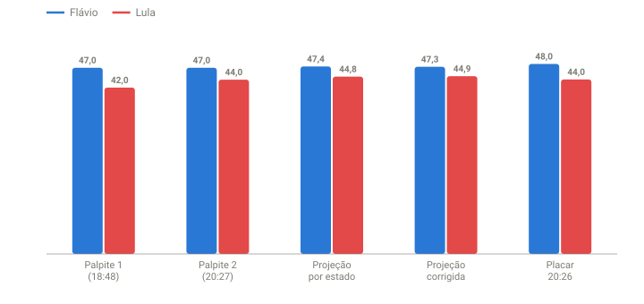

## Em resumo
- Com 91% apurado, ajustei o palpite das 18:48 de 47 x 42 para **47 x 44**.
- O ajuste corrigiu o ponto fraco do primeiro palpite: agora os outros candidatos ficam com ~9%, perto dos 8% reais.
- As duas projeções apontavam para ~47,3 x ~44,8. Arredondando, **47 x 45** era o mais provável, e 47 x 44 estava dentro da margem.

## A pergunta
Teve uma atualização e o que eu imaginava está se confirmando: **47 x 44**. Bate com os dados?

## Para entender
- O **palpite** é uma leitura pessoal; as **projeções** são contas a partir dos dados. Comparar os dois mostra se a intuição está calibrada.
- A diferença entre "47 x 44" e "47 x 45" é ~1 ponto do Lula, o equivalente a ~1,2 milhão de votos.

## O que os dados mostraram
Às 20:26 (soma das UFs, 90,97% das seções): **Flávio 47,98% x Lula 44,05%**, igual ao UOL das 20:27 (91,06%). Diferença: 4,25 milhões de votos.

**Como ler o gráfico:** cada grupo compara Flávio (azul) e Lula (vermelho): os dois palpites, as duas projeções e o placar das 20:26. O Flávio aparece em ~47 em todas as estimativas; a diferença está no Lula: 42 no primeiro palpite, 44 no segundo e ~44,8 nas projeções.

| | Flávio | Lula | Outros |
|---|---|---|---|
| Palpite original (18:48) | 47% | 42% | 11% |
| **Palpite ajustado (20:27)** | **47%** | **44%** | **9%** |
| Placar 20:26 | 47,98% | 44,05% | 7,97% |
| Projeção por estado | 47,35% | 44,78% | 7,87% |
| Projeção corrigida (margem tardia, case 11) | 47,26% | 44,88% | 7,86% |

O último lote antes do palpite (464 mil válidos) deu **Lula 52,3% x Flávio 40,7%**, a mesma tendência desde 19:14.

## Como calculei
`analise/revisao.py` e a projeção corrigida do case 12, rodadas na coleta das 20:26. Palpite registrado em `dados/palpites.csv`, junto com a projeção do mesmo momento.

## Conclusão
O ajuste do Lula de 42 para 44 corrigiu o erro do primeiro palpite: a soma deixa ~9% para os outros candidatos, perto dos ~8% reais. As duas projeções põem o Flávio em ~47,3% e o Lula em ~44,8%. Arredondando, **47 x 45 é o mais provável**. O 47 x 44 acontece se a reta final for um pouco menos favorável ao Lula do que os últimos lotes vinham sendo.

## Desfecho
_placar final: Flávio __% x Lula __%_
