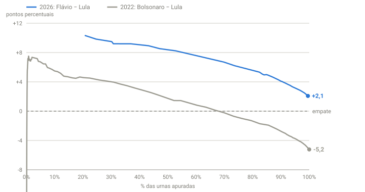

## Em resumo
- Comparei a **diferença entre o candidato do PL e o do PT** ao longo da apuração em 2022 (Bolsonaro − Lula) e em 2026 (Flávio − Lula).
- No começo, as curvas têm formas opostas: em 2022 a vantagem do Bolsonaro já caía; em 2026 a do Flávio **subia** até ~20% apurado.
- Da metade em diante, as curvas ficam quase **paralelas**, separadas por ~7 p.p. Se continuarem assim até o fim, o Flávio termina ~1,7 p.p. à frente.

## A pergunta
Quero lembrar como foram 2018, 2022 e 2026. As curvas parecem bem diferentes, e é nelas que eu quero me basear.

## Para entender
- **Curva da diferença:** em vez de duas linhas (uma por candidato), uma só: a distância entre eles. Acima de zero, o candidato do PL lidera; abaixo, o do PT.
- **Curvas paralelas** significam que, naquele trecho, os votos chegam no mesmo "ritmo" nos dois anos, só que um ano começou com vantagem maior.
- O eixo horizontal é o **% de urnas apuradas**, não a hora. Isso permite comparar anos com horários diferentes.

## O que os dados mostraram

**Como ler o gráfico:** a linha cinza é 2022 (Bolsonaro − Lula) e a azul, 2026 (Flávio − Lula). A linha tracejada é o empate. A curva cinza cruza o zero com ~67% apurado, quando o Lula passou à frente em 2022. A azul começa em ~20% (início da nossa coleta automática) e desce de forma parecida com a cinza da metade em diante, sempre ~7 p.p. acima.

| Urnas | 2022 | 2026 | 2026 − 2022 |
|---|---|---|---|
| 1% | +7,1 | +6,4 | −0,8 |
| 5% | +6,7 | +9,1 | +2,3 |
| 10% | +5,5 | +10,2 | +4,7 |
| 20% | +4,6 | **+10,5** (pico) | +5,9 |
| 30% | +4,0 | +9,5 | +5,5 |
| 40% | +2,9 | +9,0 | +6,1 |
| 50% | +1,5 | +8,6 | +7,1 |
| 70% | −0,2 (virada ~67%) | +6,7 | +6,9 |
| 80% | −1,3 | +5,3 | +6,6 |
| 90% | −2,8 | +4,1 | +6,9 |
| 100% | **−5,2** (final) | ? | |

(diferença em p.p.; os pontos até 20% de 2026 vêm da série do UOL, antes de a coleta automática começar)

**Três fases:**
1. **0–20%: formas opostas.** Em 2022 a vantagem do Bolsonaro caía desde 5%. Em 2026 a do Flávio **subiu** até o pico de +10,5 com 20%.
2. **20–50%: 2026 cai mais devagar.** A distância entre as curvas cresce de ~6 para ~7 p.p.
3. **50–90%: paralelas.** A distância fica entre **6,6 e 7,1 p.p.**, e a diferença cai no mesmo ritmo nos dois anos (~0,1 p.p. por 1% de urnas).

**2018 (1º turno):** resultado final Bolsonaro 46,03% x Haddad 29,28%. A curva de evolução do 1º turno não estava disponível na fonte usada (o UOL tem só o histórico de 2022). O 2º turno de 2018 entra no case 15.

## Como calculei
- **2022:** série do UOL (`dados/uol-historico-2022.json`, 317 pontos).
- **2026:** série do UOL até ~65% mais a nossa coleta (soma das UFs) até 99,5%.
- Para cada % de urnas, o ponto mais próximo de cada série. O gráfico também está no painel: "A diferença ao longo da apuração: 2022 x 2026".

## Conclusão
A ordem regional da apuração é a mesma nos dois anos (Sul e Sudeste primeiro, Nordeste depois). Por isso, da metade em diante, as curvas têm a **mesma forma**: 2026 parece 2022 deslocado ~7 p.p. a favor do candidato do PL. O começo diferente (o Flávio subindo até 20%) sugere que, em 2026, as primeiras urnas do Nordeste chegaram ainda mais tarde, ou que as do Sul vieram mais fortes.

Se a forma de 2022 se mantiver até o fim, **2026 termina com o Flávio ~+1,7 p.p.** É o cenário mais favorável ao Lula entre as estimativas do case 12 (1,5 a 3 p.p.).

## Desfecho
**Resultado final do 1º turno (100% das seções, TSE 05/10 02:59):** Flávio Bolsonaro **47,03%** (56.104.503 votos) x Lula **45,16%** (53.879.538), diferença de 2.224.965 votos (1,87 p.p.). 2º turno em 25/10.

A forma de 2022 previu **+1,7 p.p.**; a diferença real foi **+1,87 p.p.** (erro de 0,17). Foi a estimativa mais precisa da noite. Da metade da apuração até o fim, 2026 seguiu de fato a forma de 2022, deslocada ~7 p.p.

**Para incluir o 1º turno de 2018 (e validar):** o TSE publica os boletins de urna de cada seção com a **hora de recebimento**. Ordenando as seções por essa hora e somando os votos, dá para reconstruir a curva de qualquer ano. Testar primeiro em 2022, comparando com a curva real do UOL, e depois aplicar a 2018. Bom tema para uma matéria em R.
