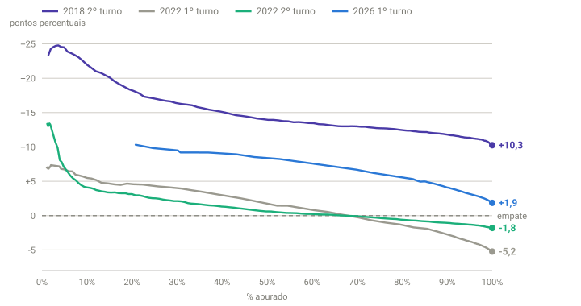

## Em resumo
- Encontrei a evolução **minuto a minuto do 2º turno de 2018** num infográfico do g1 (fonte TSE) e transcrevi as 320 linhas.
- Com ela, comparei quatro apurações: 2018 (2º turno), 2022 (1º e 2º turnos) e 2026 (1º turno).
- O padrão se repete em todas: o candidato do PSL/PL começa com vantagem maior que a final e perde terreno até o fim. O que muda é a intensidade e o momento.

## A pergunta
Quero lembrar como foram 2018, 2022 e 2026. As curvas parecem bem diferentes, e é nelas que eu quero me basear.

## Para entender
- Em todas as curvas, "diferença" = candidato do PSL/PL − candidato do PT, em p.p.
- **"Quanto ainda faltava andar":** a diferença entre o valor naquele ponto e o resultado final. Mostra quanto do ajuste ainda estava por vir.
- **Reta final:** o que acontece a partir de ~90% apurado.
- Para 2018, o eixo é o **% dos votos válidos finais já contados**, que fica muito próximo do % de urnas apuradas.

## O que os dados mostraram

**Como ler o gráfico:** cada linha é uma apuração. Roxo = 2018 2º turno (Bolsonaro − Haddad); cinza = 2022 1º turno; verde = 2022 2º turno (Bolsonaro − Lula); azul = 2026 1º turno (Flávio − Lula). Todas descem ao longo do eixo, ou seja, o candidato do PSL/PL sempre perde terreno ao longo da apuração. A de 2018 desce rápido no início e fica quase plana; a cinza (2022, 1º turno) desce até o fim; a azul (2026) é a única que sobe no começo.

**Diferença por % apurado** (entre parênteses, quanto ainda faltava andar até o final):

| % | 2018 2º turno | 2022 1º turno | 2022 2º turno | 2026 1º turno |
|---|---|---|---|---|
| 2% | +24,3 (−14,0) | +7,4 (−12,6) | +12,8 (−14,6) | +7,3 |
| 5% | +24,5 (−14,2) | +6,7 (−12,0) | +7,1 (−8,9) | +9,1 |
| 10% | +22,0 (−11,7) | +5,5 (−10,7) | +4,1 (−5,9) | +10,2 |
| 20% | +18,1 (−7,9) | +4,6 (−9,8) | +3,1 (−4,9) | **+10,5** |
| 30% | +16,4 (−6,1) | +4,0 (−9,2) | +2,1 (−3,9) | +9,5 |
| 50% | +13,9 (−3,7) | +1,5 (−6,7) | +0,6 (−2,4) | +8,6 |
| 70% | +13,0 (−2,7) | −0,2 (−5,0) | −0,1 (−1,7) | +6,7 |
| 80% | +12,4 (−2,2) | −1,3 (−4,0) | −0,6 (−1,2) | +5,3 |
| 90% | +11,8 (−1,5) | −2,8 (−2,4) | −1,1 (−0,7) | +4,1 |
| Final | **+10,3** | **−5,2** | **−1,8** | ? |

**As formas diferentes:**
- **2º turno (2018 e 2022):** a maior parte do ajuste acontece até ~20% apurado; depois, a curva fica quase plana.
- **2022, 1º turno:** o ajuste se espalha pela noite toda. Ainda faltavam 2,4 p.p. a partir de 90%.
- **2026, 1º turno:** a vantagem do Flávio **sobe** no começo (até 20%) e, depois, cai no ritmo do 1º turno de 2022.

**Aplicando a reta final de cada eleição aos +4,1 de 2026 com 90%:**

| Se 2026 terminar como… | Andou a partir de 90% | Flávio − Lula final |
|---|---|---|
| 2022 1º turno | −2,4 | **+1,7** |
| 2018 2º turno | −1,5 | **+2,6** |
| 2022 2º turno | −0,7 | **+3,4** |

## Como calculei
- **2018 2º turno:** `dados/historico/2018-t2-g1-minuto.csv` (transcrito do infográfico do g1; o final confere com o oficial: Bolsonaro 57.797.847 votos, 55,13%). % apurado = válidos acumulados ÷ válidos finais (104.838.753); diferença = 2 × % Bolsonaro − 100.
- **2022, dois turnos:** séries do UOL (`dados/uol-historico-2022*.json`, só locais).
- **2026:** UOL + soma das UFs.
- Para cada %, o ponto mais próximo de cada série (até 3 p.p. de distância).

## Conclusão
As curvas parecem diferentes, mas contam a mesma história: **o começo da apuração favorece quem é forte no Sul e no Sudeste, e a reta final favorece quem é forte no Nordeste** (nessas eleições, os candidatos do PSL/PL e do PT, respectivamente). Variam a intensidade e o momento.

A faixa para 2026 (de +1,7 a +3,4, com centro em ~+2,5) coincide com as projeções do case 12 (~+2,4). **Três métodos independentes apontam para o mesmo lugar.**

Para o **2º turno de 2026** (25/10), já temos as duas referências de 2º turno (2018 e 2022), com a forma típica: ajuste rápido até ~20% e depois quase plano.

## Desfecho
**Resultado final do 1º turno (100% das seções, TSE 05/10 02:59):** Flávio Bolsonaro **47,03%** (56.104.503 votos) x Lula **45,16%** (53.879.538), diferença de 2.224.965 votos (1,87 p.p.). 2º turno em 25/10.

Com 90% apurado a diferença era +4,1; no fim, +1,87. A reta final andou **−2,2 p.p.**, quase o mesmo que o **1º turno de 2022 (−2,4)**, que previa +1,7. As referências de 2º turno (2018: +2,6; 2022: +3,4) ficaram mais longe, o que faz sentido: a reta final de um 1º turno se parece mais com outro 1º turno.

**Lacuna:** falta o **1º turno de 2018**, que seria a comparação mais direta com 2026. Ver o case 14 para reconstruí-lo pelos boletins de urna.
