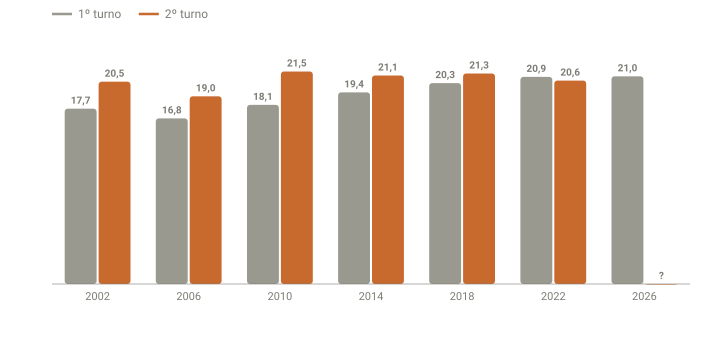

## Em resumo
- A **abstenção** (eleitores aptos que não foram votar) cresce eleição após eleição: de 16,8% em 2006 para ~21% em 2026, que caminha para o maior valor de 1º turno da série.
- No 2º turno, a abstenção **subiu em todos os anos, menos em 2022**, a disputa mais apertada.
- Entre os turnos, **o 2º colocado costuma ganhar mais votos** (5 de 6 eleições), mas **o 1º colocado venceu todas as seis**.

## A pergunta
A abstenção é muito alta todo ano. Como foi nos anos com 2º turno? Quem ganhou mais votos de um turno para o outro, e quem melhorou ou piorou em cada cenário?

## Para entender
- **Aptos:** eleitores que podem votar. **Comparecimento:** quem foi votar. **Abstenção:** aptos − comparecimento.
- **Brancos e nulos** são de quem compareceu mas não escolheu candidato; ficam fora dos **válidos**.
- **Ganho entre turnos:** votos do candidato no 2º turno − votos dele no 1º. Vêm de eleitores de candidatos eliminados, de quem se absteve no 1º turno e de quem votou branco ou nulo.

## O que os dados mostraram
Dados oficiais do TSE (dados abertos, 2002–2022), em `dados/historico/presidente_turnos.csv` e `presidente_votos.csv`.

**Como ler o gráfico:** para cada ano, a barra cinza é a abstenção no 1º turno e a laranja, no 2º. A laranja é maior em todos os anos, menos em 2022. A tendência de fundo é de alta. Em 2026 só há o 1º turno (parcial).

| Ano | Aptos | Abstenção 1º turno | Abstenção 2º turno | Variação |
|---|---|---|---|---|
| 2002 | 115,3 mi | 17,74% | 20,47% | +2,7 p.p. (+3,1 mi) |
| 2006 | 125,9 mi | 16,75% | 18,99% | +2,2 p.p. (+2,8 mi) |
| 2010 | 135,8 mi | 18,12% | 21,50% | +3,4 p.p. (+4,6 mi) |
| 2014 | 142,8 mi | 19,39% | 21,10% | +1,7 p.p. (+2,4 mi) |
| 2018 | 147,3 mi | 20,33% | 21,30% | +1,0 p.p. (+1,4 mi) |
| 2022 | 156,5 mi | 20,95% | **20,58%** | **−0,4 p.p. (−0,6 mi)** |
| 2026 | 158,7 mi | **21,01%** (parcial, 92%) | | |

**Quem ganhou votos entre os turnos** (1º e 2º colocados do 1º turno):

| Ano | 1º turno | 2º turno | Ganho do 1º colocado | Ganho do 2º colocado | Fatia do 2º colocado nos votos novos |
|---|---|---|---|---|---|
| 2002 | Lula 46,4 x Serra 23,2 | Lula 61,3 x 38,7 | +13,3 mi | **+13,7 mi** | 51% |
| 2006 | Lula 48,6 x Alckmin 41,6 | Lula 60,8 x 39,2 | **+11,6 mi** | **−2,4 mi** (perdeu votos) | — |
| 2010 | Dilma 46,9 x Serra 32,6 | Dilma 56,1 x 43,9 | +8,1 mi | **+10,6 mi** | 57% |
| 2014 | Dilma 41,6 x Aécio 33,6 | Dilma 51,6 x 48,4 | +11,2 mi | **+16,1 mi** | 59% |
| 2018 | Bolsonaro 46,0 x Haddad 29,3 | Bolsonaro 55,1 x 44,9 | +8,5 mi | **+15,7 mi** | 65% |
| 2022 | Lula 48,4 x Bolsonaro 43,2 | Lula 50,9 x 49,1 | +3,1 mi | **+7,1 mi** | 70% |

**Brancos + nulos** (variação do 1º para o 2º turno): caíram em 2002 (−4,4 mi), 2006 (−2,7 mi), 2010 (−2,5 mi) e 2014 (−4,0 mi), e subiram em 2018 (+0,8 mi) e 2022 (+0,3 mi).

## Como calculei
`analise/historico_tse.py` baixa o `detalhe_votacao_munzona` (aptos, comparecimento, abstenção, brancos, nulos) e só o `*_BR.csv` do `votacao_partido_munzona` de cada ano, lendo o zip remoto por partes (HTTP Range) em vez dos ~400 MB do arquivo completo. Para presidente, voto no partido = voto no candidato. Abstenção de 2026: abstenções ÷ eleitorado das seções já apuradas (banco SQLite, 20:44).

## Conclusão
- **Abstenção:** sobe no longo prazo e costuma subir do 1º para o 2º turno. 2022 foi a exceção: quanto mais disputado o 2º turno, mais ele mobiliza.
- **Votos entre turnos:** o 2º colocado normalmente cresce mais, porque herda eleitores de candidatos eliminados e é quem precisa buscá-los. Mas, nas seis eleições, isso nunca bastou para virar.
- **Para 2026**, a história dá sinais nos dois sentidos: o líder do 1º turno (Flávio) tem o retrospecto a favor; o 2º colocado (Lula) tem a seu favor a diferença menor, ~2,4 p.p. contra 5,2 em 2022. O case 17 transforma isso em cenários.

## Desfecho
_2º turno de 25/10: abstenção __%; Flávio ganhou __ mi e Lula __ mi entre os turnos._
