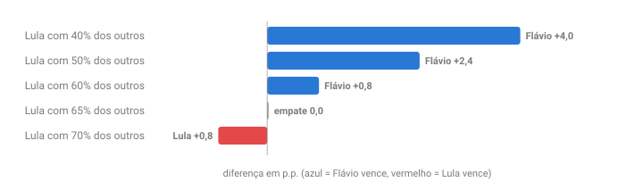

## Em resumo
- O ponto de partida do 2º turno é o resultado do 1º: **Flávio ~47,3% x Lula ~44,9%**, com ~7,9% para os outros candidatos.
- Se os votos dos outros se dividirem meio a meio, o Flávio vence por ~2,4 p.p. **O Lula empata se ficar com ~65% deles**, algo que já aconteceu com 2º colocados em 2018 e 2022.
- É uma vantagem leve. Uma mudança de ~1,2% do eleitorado decide a eleição, e a campanha pode mover isso.

## A pergunta
Pelo cenário atual, o Flávio sai favorito para o 2º turno? Ainda há uma campanha inteira pela frente, com debates, ataques dos dois lados e possíveis denúncias.

## Para entender
- **Transferência de votos:** no 2º turno, os eleitores dos candidatos eliminados escolhem um dos dois finalistas, votam branco ou nulo, ou se abstêm.
- Este cenário olha só a **redistribuição dos votos dos outros**. Abstenção, brancos e nulos ficam constantes (o case 16 mostra quanto eles variam).
- **Trocar de lado:** eleitor que votou num finalista no 1º turno e vota no outro no 2º. Cada eleitor que troca muda a diferença em dois votos.

## O que os dados mostraram
**Ponto de partida** (projeção corrigida do 1º turno, cases 12 e 13): **Flávio 47,26% x Lula 44,88%**. Os outros candidatos somam **7,86%** (~9 milhões de votos às 20:47):

| Candidato | % dos válidos (20:47) | Votos | Campo |
|---|---|---|---|
| Augusto Cury (Avante) | 2,92% | 3,24 mi | centro |
| Renan Santos (Missão) | 2,29% | 2,53 mi | direita |
| Ronaldo Caiado (PSD) | 2,23% | 2,48 mi | direita |
| Zema (Novo) | 0,28% | 0,31 mi | direita |
| Samara (UP) | 0,10% | 0,12 mi | esquerda |
| Hertz Dias (PSTU) | 0,04% | 0,04 mi | esquerda |
| Edmilson Costa (PCB) | 0,02% | 0,02 mi | esquerda |
| Rui Costa Pimenta (PCO) | 0,01% | 0,01 mi | esquerda |
| Clariana Barão (DC) | 0,03% | 0,04 mi | direita |
| Wilson Grassi (Democrata) | 0,01% | 0,02 mi | outros |

**Como ler o gráfico:** cada barra é um cenário de divisão dos votos dos outros candidatos. Azul, à direita = o Flávio vence por essa diferença; vermelho, à esquerda = o Lula vence. A virada acontece entre 65% e 70%.

| O Lula fica com… dos votos dos outros | Resultado do 2º turno |
|---|---|
| 40% | Flávio 52,0 x 48,0 |
| 50% | Flávio 51,2 x 48,8 |
| 60% | Flávio 50,4 x 49,6 |
| **65%** | **empate** |
| 70% | Lula 50,4 x 49,6 |

Outra forma de ver: com os outros divididos meio a meio, o empate exige que **~1,2% dos eleitores válidos (~1,4 milhão de pessoas)** troquem do Flávio para o Lula.

**Referências históricas** (case 16): o 2º colocado do 1º turno ficou com 51% a 70% dos votos novos entre os turnos: Haddad ~65% em 2018, Bolsonaro ~70% em 2022.

## Como calculei
Base = projeção corrigida do 1º turno. Para cada cenário: Flávio = 47,26 + 7,86 × (1 − s); Lula = 44,88 + 7,86 × s, em que *s* é a fatia do Lula nos votos dos outros; depois, renormalizado para 100%. A classificação "campo" é uma descrição simplificada do posicionamento de cada candidato, para fins de cenário.

## Conclusão
**Pelo 1º turno, o Flávio é favorito, mas por pouco.**
- **O que pesa a favor dele:** ~4,8 dos 7,9 p.p. dos outros vêm de candidatos de direita e centro-direita (Renan Santos 2,3, Caiado 2,2, Zema 0,3), e o líder do 1º turno venceu os seis 2º turnos desde 2002 (case 16).
- **O que mantém a disputa aberta:** os 65% de que o Lula precisa estão dentro do que já aconteceu (Haddad em 2018, Bolsonaro em 2022). E a margem é estreita: ~1,2% do eleitorado mudando de lado empata.
- **O que os dados não medem:** campanha, debates, alianças, denúncias contra qualquer um dos lados, mobilização de quem se absteve (21% do eleitorado). Uma variação de 1–2 p.p., comum ao longo de uma campanha de 2º turno, decide.

**Leitura:** vantagem leve do Flávio no ponto de partida, disputa competitiva. Os próximos dados relevantes são as **primeiras pesquisas de 2º turno** e o **apoio declarado** de Cury, Caiado e Renan Santos.

## Desfecho
**Resultado final do 1º turno (100% das seções, TSE 05/10 02:59):** Flávio Bolsonaro **47,03%** (56.104.503 votos) x Lula **45,16%** (53.879.538), diferença de 2.224.965 votos (1,87 p.p.). 2º turno em 25/10.

**Ponto de partida atualizado com o resultado final:** Flávio 47,03% x Lula 45,16%, outros 7,81% (Cury 2,89, Renan Santos 2,24, Caiado 2,18, Zema 0,27 e os demais 0,23). Com a diferença final menor que a projetada às 20:50, **o Lula empata se ficar com ~62% dos votos dos outros** (e não 65%). O cenário fica mais equilibrado do que parecia na noite.

_2º turno (25/10): Flávio __% x Lula __%. Quanto dos votos dos outros foi para cada um?_
