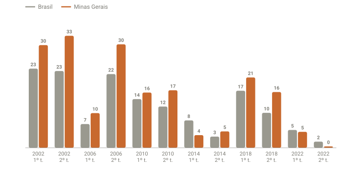

## Em resumo
- A frase "quem ganha em Minas ganha o Brasil" se sustenta nos dados oficiais: **12 de 12 turnos** desde 2002. Só o Amazonas tem o mesmo retrospecto.
- Minas acerta porque **se parece com o Brasil**: o norte do estado vota como o Nordeste; o Triângulo e o sul, como São Paulo e o Centro-Oeste.
- Em 2026, o Flávio lidera em Minas por ~6 p.p., mais que no país (~3,5 p.p. no mesmo momento).

## A pergunta
Historicamente, o candidato que ganha em Minas ganhou a eleição, né?

## Para entender
- **Estado bellwether:** estado cujo resultado costuma coincidir com o nacional. Não é que ele "decida"; ele reflete a média do país.
- Comparar a **margem** (diferença entre os dois primeiros) em Minas e no Brasil mostra o quanto o estado se afasta da média.

## O que os dados mostraram
Dados oficiais do TSE por UF (`dados/historico/presidente_votos_uf.csv`):

**Como ler o gráfico:** para cada turno, a barra cinza é a vantagem do vencedor nacional no Brasil e a laranja, em Minas, em pontos percentuais. As duas barras estão sempre do mesmo lado (positivas): o vencedor nacional também venceu em Minas. Nas disputas apertadas (2014 e 2022, 2º turno), as barras ficam pequenas e parecidas.

| Ano | Turno | Brasil | Minas Gerais | Minas acertou? |
|---|---|---|---|---|
| 2002 | 1º | Lula 46,4 x Serra 23,2 | Lula 53,0 x 22,9 | ✅ |
| 2002 | 2º | Lula 61,3 x 38,7 | Lula 66,4 x 33,6 | ✅ |
| 2006 | 1º | Lula 48,6 x Alckmin 41,6 | Lula 50,8 x 40,6 | ✅ |
| 2006 | 2º | Lula 60,8 x 39,2 | Lula 65,2 x 34,8 | ✅ |
| 2010 | 1º | Dilma 46,9 x Serra 32,6 | Dilma 47,0 x 30,8 | ✅ |
| 2010 | 2º | Dilma 56,1 x 43,9 | Dilma 58,4 x 41,6 | ✅ |
| 2014 | 1º | Dilma 41,6 x Aécio 33,5 | Dilma 43,5 x 39,8 | ✅ (o Aécio, mineiro, perdeu em casa) |
| 2014 | 2º | Dilma 51,6 x 48,4 | Dilma 52,4 x 47,6 | ✅ |
| 2018 | 1º | Bolsonaro 46,0 x Haddad 29,3 | Bolsonaro 48,3 x 27,6 | ✅ |
| 2018 | 2º | Bolsonaro 55,1 x 44,9 | Bolsonaro 58,2 x 41,8 | ✅ |
| 2022 | 1º | Lula 48,4 x Bolsonaro 43,2 | Lula 48,3 x 43,6 | ✅ |
| 2022 | 2º | Lula 50,9 x 49,1 | Lula 50,2 x 49,8 | ✅ |

**12 de 12.** Nas disputas apertadas (2014 e 2022, 2º turno), a margem em Minas ficou a menos de 1,5 p.p. da nacional.

**2026, 1º turno:**

| Momento | % de Minas apurado | Flávio | Lula | Margem em MG | Margem no Brasil |
|---|---|---|---|---|---|
| 18:13 (g1) | 13,05% | 49,12% | 41,48% | +7,6 | +10,4 |
| 20:54 (TSE) | 90,84% | 48,74% | 42,68% | +6,1 | +3,1 |
| 21:00 (g1) | 94,07% | 48,63% | 42,83% | +5,8 | +2,5 |

O Zema, ex-governador de Minas, teve ~0,8% no estado.

## Como calculei
`analise/historico_tse.py` passou a guardar os votos de presidente por UF (do mesmo `votacao_partido_munzona_*_BR.csv`). Para cada turno, o vencedor nacional comparado ao vencedor em MG, e as margens nos dois. Os números de 2026 vêm do banco (coleta das 20:54) e dos prints do g1.

## Conclusão
A regra se sustenta: **Minas acertou todos os turnos desde 2002**. Em 2026, o Flávio lidera em Minas com folga (~6 p.p.), na linha do 1º turno de 2018, quando Minas ficou ~2–4 p.p. mais favorável à direita que o Brasil. Para o 2º turno, é o termômetro a acompanhar: em 2022, o Lula venceu no país com 50,2% em Minas. Quem tiver a vantagem em Minas no 2º turno de 2026 deve ter a vantagem no país.

Cuidado: é uma **regularidade**, não uma lei. Ela acerta porque Minas se parece com a média do Brasil, não porque "decide" a eleição.

## Desfecho
_2º turno (25/10): quem ganhou em Minas, e Minas acertou de novo?_
