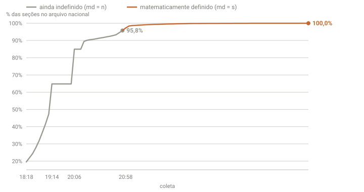

## Em resumo
- O arquivo nacional do TSE tem um campo que diz se o resultado já está **matematicamente definido**.
- Ele passou de "não" para "sim" no arquivo gerado às **20:57:34**, com 97,2% das seções apuradas: haverá **2º turno entre Flávio Bolsonaro e Lula**.
- A projeção por estado indicava isso desde 18:18, **2 horas e 39 minutos antes**.

## A pergunta
O g1 colocou o selo "2º Turno" ao lado do Flávio e do Lula. Quando isso ficou oficial?

## Para entender
- **Matematicamente definido:** mesmo que todos os votos restantes fossem para um candidato, o resultado (aqui, a ida para o 2º turno) não mudaria mais.
- No JSON do TSE, o campo é `md`: `"n"` (não) ou `"s"` (sim). Há também campos por candidato (`st`, situação; `e`, eleito), que podem ser preenchidos mais tarde.

## O que os dados mostraram

**Como ler o gráfico:** a linha mostra o % de seções no arquivo nacional do TSE em cada coleta. Cinza enquanto o resultado não estava definido (`md = n`); laranja a partir da primeira versão com `md = s`. O degrau horizontal entre 19:14 e 20:06 é a pausa do arquivo nacional (case 10).

| Coleta | Versão do arquivo nacional | % seções | `md` |
|---|---|---|---|
| 20:47 | 20:47:04 | 93,31% | n |
| 20:51 | 20:50:25 | 94,51% | n |
| 20:54 | 20:53:34 | 95,78% | n |
| **20:58** | **20:57:34** | **97,24%** | **s** |
| 21:01 | 21:00:44 | 98,36% | s |
| 21:04 | 21:03:24 | 98,64% | s |

Placar às 20:58 (soma das UFs, 96,83%): **Flávio 47,47% x Lula 44,64%**, diferença de 3,26 milhões de votos. O último lote (1,8 milhão de válidos) veio **Lula 53,6% x Flávio 39,9%**.

Em Minas (print do g1, 94%): Flávio 48,63% x Lula 42,83%, também com o selo de 2º turno.

## Como calculei
Leitura dos campos `md`, `st` e `e` de cada candidato nos `br-u.json` guardados em `dados/brutos/`. Os campos de situação dos candidatos (`st`) seguiam vazios às 20:58.

## Conclusão
A noite que começou com a pergunta "o que significa o Flávio na frente com 12%?" ficou decidida, quanto ao 1º turno, às 20h57: **haverá 2º turno**. A projeção por estado indicava isso desde a primeira coleta automática, às 18:18, ou seja, **2h39 antes** da confirmação oficial. É a melhor síntese do projeto: os dados certos, lidos do jeito certo, permitiam saber o resultado muito antes do placar.

## Desfecho
Fechado. 2º turno em 25/10/2026: Flávio Bolsonaro (PL) x Lula (PT).
