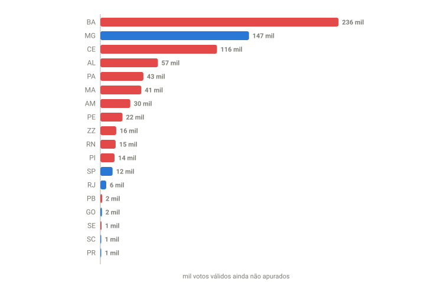

## Em resumo
- Com 99,37% apurado, o placar era **Flávio 47,15% x Lula 45,01%**. Faltavam 3.152 seções, cerca de **760 mil votos válidos** (0,6% do total).
- O que faltava estava concentrado na **Bahia, em Minas e no Ceará**, e ainda puxava um pouco a favor do Lula.
- **46 x 45 já não era possível.** Mesmo no cenário extremo (todos os votos restantes para o Lula), o Flávio só cairia até 46,85%. O resultado mais provável era **~47,1 x ~45,1**.

## A pergunta
Teve mais atualizações e o Flávio caiu mais: 47,15 x 45,01 com 99,37%. Ainda pode chegar a 46 x 45? Que estados faltam?

## Para entender
- O percentual de um candidato só cai por **diluição**: votos não diminuem, mas o total de válidos cresce. Se ele já tem X votos, o menor percentual possível é X ÷ (total final de válidos).
- **Válidos que faltam em cada estado:** válidos já apurados ÷ fração do eleitorado apurada − válidos já apurados.
- Com o que falta e o placar de cada estado, dá para estimar o cenário **mais provável** e os **limites**.

## O que os dados mostraram
Coleta das 21:32 (soma das UFs): **99,37% das seções, Flávio 47,15% x Lula 45,01%**, diferença de 2,54 milhões de votos.

**Como ler o gráfico:** cada barra é a quantidade estimada de votos válidos que ainda faltavam no estado. A cor indica quem lidera nele: vermelho = Lula, azul = Flávio. A Bahia sozinha tinha quase um terço do que faltava; somadas, as barras vermelhas são bem maiores que as azuis.

Todos os estados com seções faltando às 21:32:

| Estado | Seções faltando | Apurado | Válidos que faltam (est.) | Placar no estado (Flávio x Lula) | Saldo esperado |
|---|---|---|---|---|---|
| Bahia | 971 | 97,26% | ~236 mil | 28,7 x 65,9 | Lula +88 mil |
| Minas Gerais | 642 | 98,77% | ~147 mil | 48,4 x 43,2 | Flávio +8 mil |
| Ceará | 498 | 97,90% | ~116 mil | 31,5 x 63,1 | Lula +37 mil |
| Alagoas | 189 | 97,34% | ~57 mil | 40,6 x 54,6 | Lula +8 mil |
| Pará | 195 | 99,06% | ~43 mil | 44,7 x 49,7 | Lula +2 mil |
| Maranhão | 180 | 99,01% | ~41 mil | 31,0 x 63,9 | Lula +13 mil |
| Amazonas | 107 | 98,69% | ~30 mil | 45,4 x 47,8 | Lula +1 mil |
| Pernambuco | 84 | 99,61% | ~22 mil | 31,1 x 63,4 | Lula +7 mil |
| Exterior | 63 | 95,34% | ~16 mil | 43,8 x 47,3 | Lula +1 mil |
| Rio Grande do Norte | 61 | 99,25% | ~15 mil | 34,8 x 59,7 | Lula +4 mil |
| Piauí | 67 | 99,34% | ~14 mil | 24,1 x 70,9 | Lula +7 mil |
| São Paulo | 49 | 99,95% | ~12 mil | 51,9 x 38,2 | Flávio +2 mil |
| Rio de Janeiro | 20 | 99,95% | ~6 mil | 53,0 x 39,4 | Flávio +1 mil |
| Paraíba | 8 | 99,93% | ~2 mil | 33,1 x 61,3 | Lula +0,5 mil |
| Goiás | 6 | 99,96% | ~2 mil | 53,6 x 31,1 | Flávio +0,4 mil |
| Sergipe | 4 | 99,93% | ~1 mil | 30,6 x 62,7 | Lula +0,4 mil |
| Santa Catarina | 4 | 99,98% | ~1 mil | 66,7 x 25,0 | Flávio +0,4 mil |
| Paraná | 4 | 99,99% | ~1 mil | 59,9 x 31,2 | Flávio +0,2 mil |
| **Total** | **3.152** | | **~760 mil** | | **Lula +156 mil** (435 mil x 278 mil) |

Todos os outros estados já estavam com 100% apurado.

**Cenários para o resultado final:**

| Cenário | Flávio | Lula | Diferença |
|---|---|---|---|
| Placar às 21:32 | 47,15% | 45,01% | 2,14 p.p. |
| **Cada estado termina como está (mais provável)** | **47,09%** | **45,09%** | **2,00 p.p.** |
| Todos os votos restantes para o Lula (limite teórico) | 46,85% | 45,36% | 1,49 p.p. |
| Para o Flávio chegar a 46,0% | precisaria **perder** ~1 milhão de votos (impossível) | | |

## Como calculei
Por UF: seções faltando = total − apuradas; válidos que faltam = válidos ÷ fração do eleitorado apurado − válidos; saldo esperado = válidos que faltam × (% Flávio − % Lula) na UF. Cenário mais provável = soma dos votos atuais com os que faltam, no placar de cada UF. Limite = votos atuais do Flávio ÷ válidos finais estimados.

## Conclusão
**46 x 45 não era mais possível.** O que faltava (~0,6% dos votos) ainda favorecia o Lula, porque se concentrava na Bahia, no Ceará e em Alagoas, mas só o bastante para tirar ~0,06 p.p. do Flávio. O resultado deve fechar em **~47,1 x ~45,1, ou 47 x 45 arredondado**.

Comparando com o que foi estimado ao longo da noite:

| Estimativa | Flávio | Lula | Distância do mais provável |
|---|---|---|---|
| Projeção por estado às 18:18 (case 03) | 49,0 | 43,1 | ~2 p.p. em cada |
| Palpite original, 18:48 (case 06) | 47 | 42 | Flávio ✓, Lula −3 |
| Projeção corrigida, 20:14 (case 12) | 47,29 | 44,86 | ~0,2 p.p. em cada |
| Palpite ajustado, 20:27 (case 13) | 47 | 44 | Flávio ✓, Lula −1 |

## Desfecho
**Checagem às 22:00 (99,74%):** placar **Flávio 47,09% x Lula 45,09%**, exatamente o cenário "mais provável" calculado às 21:32, mas com 0,26% das seções ainda por apurar. Entre 21:32 e 22:00 entraram 451 mil válidos com **Lula 66,3% x Flávio 29,3%**, um pouco mais favoráveis ao Lula que a média dos estados de onde vieram (sobretudo Bahia e Ceará). É o mesmo viés do case 11, em escala pequena. Faltavam 1.286 seções (~305 mil válidos: BA 506, MG 200, CE 194), e a projeção passou a **47,06 x 45,13**.

**Checagem às 22:17 (99,86%):** Flávio 47,06% x Lula 45,12%. Faltavam 685 seções (~165 mil válidos: BA 262, CE 123, MG 71, MA 51, AM 40, PI 35). Mais provável no fim: **47,04 x 45,14**; limite teórico (tudo para o Lula): 47,00 x 45,20. O Flávio não fica abaixo de 47%.

_resultado final oficial: Flávio __% x Lula __%_
